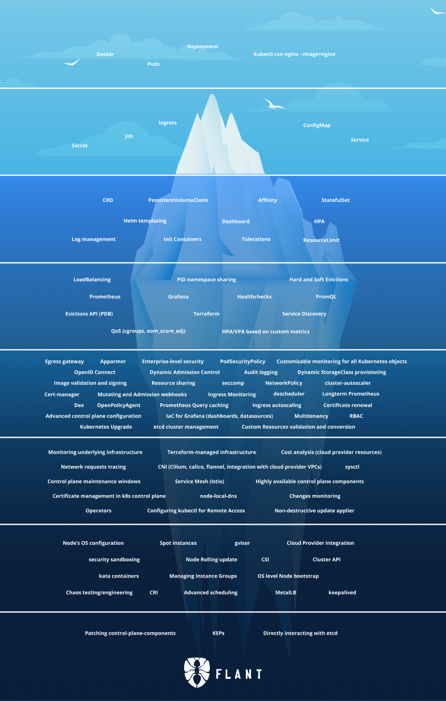

# [kubernetes iceberg](/2022/05/kubernetes_iceberg.md)

最近推特上看到这个 k8s 冰山理论的图，我想我目前对 k8s 的理解就只有第二层，就刚接触一点点 configmap 之类的

主要有个障碍是公司的应用给客户的私有 k8s 集群部署的时候都是通过公司固定那 1-2 个云原生工程师去干，
我这一直没法接触过深的 k8s 内容

感叹到要想学习 operator 等概念只能在自己的 minikube 上面去学习了

不过我有一个方法偷学，就是 bash history 就能学到同事用的

## lstio 就是个复杂版的 nginx

但服务网格好像多了一些流量控制等网络相关功能

## k8s 一些难懂的概念

- 驱逐(貌似资源不够或一个 pod 占用资源过多挤兑其他人)
- 污点
- 容忍
- job
