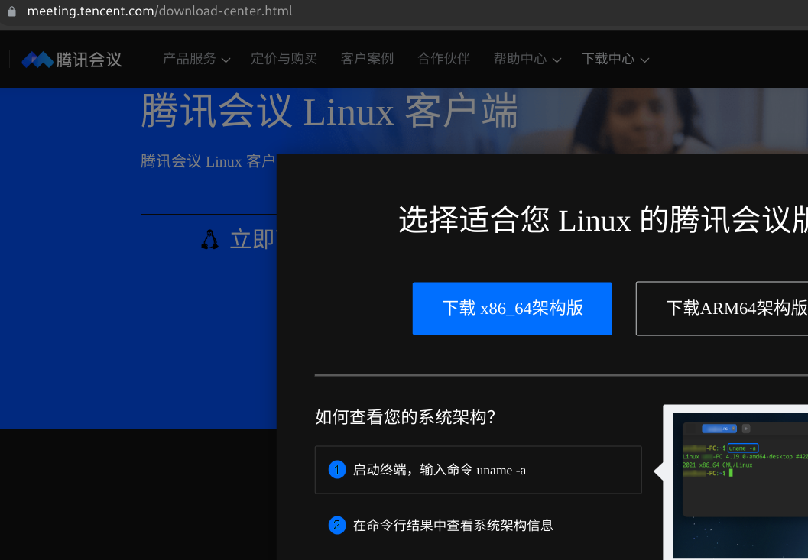
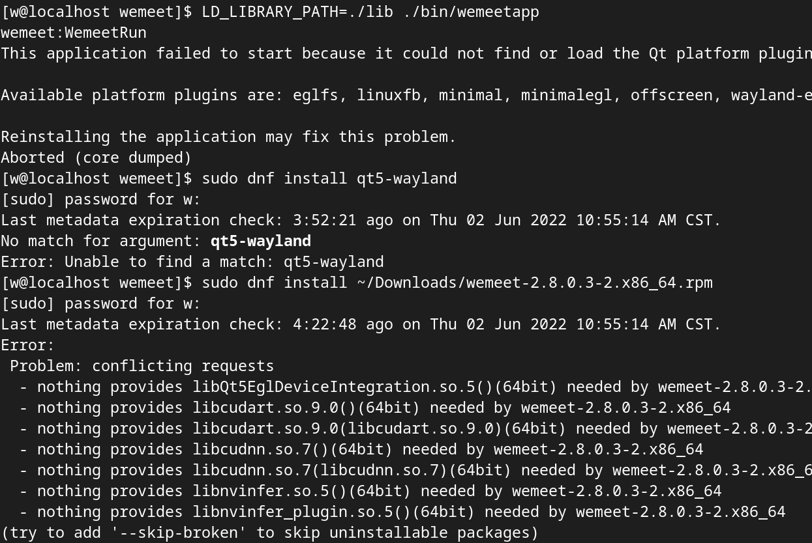

# [tencent meeting linux](/2022/06/tencent_meeting_linux_client.md)

看到同事说今年腾讯会议居然出了 Linux 客户端他的 Ubuntu 使用正常，

飞书的跨平台是通过 Electron 实现所以兼容性很好甚至网页版的飞书会议也能共享桌面

而腾讯会议是 qt 应用，只有 deb 包下载，在 fedora 36 下无论是 wayland 还是 xorg 都无法用

即便我用 alien 工具将 deb 转换成 rpm 也无法使用

