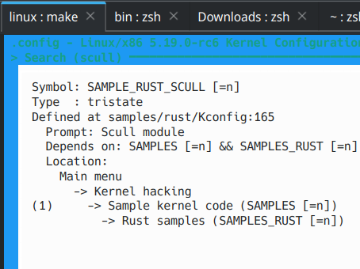
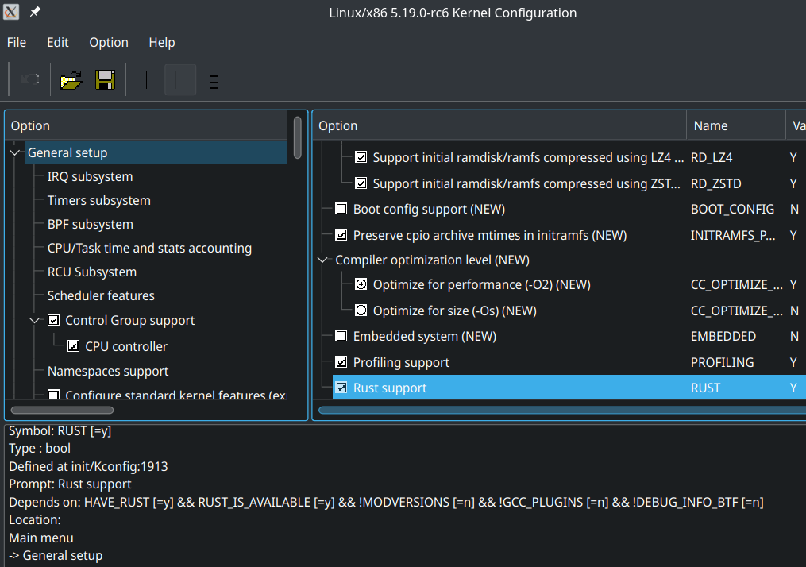
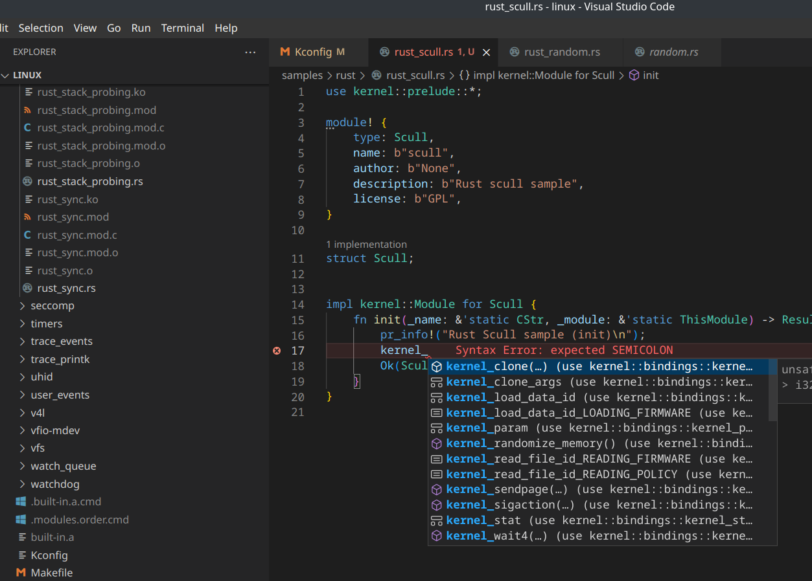

# [Linux 源码 Rust 示例](/2022/07/rust_for_linux_build_samples_rust.md)

## 编译内核模块的失败尝试

读此文之前我想起我失败的内核模块编译的经历:
- 如何在编译时链接 linux-headers 包所在的库文件？
- rust 要如何使用 c 库中大量的宏

当系统装了 linux-header 包之后就能在 /usr/lib/modules 下面找到内核头文件的定义，然后用里面的 makefile 可以构建内核模块编译成 ko 文件

```
[w@ww ~]$ realpath /usr/lib/modules/$(uname -r)
/usr/lib/modules/5.10.129-1-MANJARO
```

而 Rust-for-Linux 的开发流程是在 Linux 源码的基础上结合 Rust 构建一个完整的内核？然后部署到 qemu 去测试

---

## 编译 Linux 源码

根据此文的教程准备构建: <https://wusyong.github.io/posts/rust-kernel-module-00/>

Rust-for-Linux 构建需要装 rust-src 和 bindgen, 然后检查 Rust 是否正确安装:

> make LLVM=1 rustavailable

然后就从 .github CI 里面抄一份 .config 文件就可以开始编译

由于构建过程 rustc deny(warnings) 所以建议使用推荐的 rustc 版本去构建避免报错:

```
*** Rust compiler 'rustc' is too new. This may or may not work.
***   Your version:     1.64.0
***   Expected version: 1.62.0
***
***
*** Rust bindings generator 'bindgen' is too new. This may or may not work.
***   Your version:     0.60.1
***   Expected version: 0.56.0
***
  UPD     rust/target.json
  BINDGEN rust/bindings/bindings_generated.rs
  BINDGEN rust/bindings/bindings_helpers_generated.rs
  RUSTC L rust/core.o
  EXPORTS rust/exports_core_generated.h
  RUSTC P rust/libmacros.so
  RUSTC L rust/compiler_builtins.o
  RUSTC L rust/alloc.o
  RUSTC L rust/bindings.o
  RUSTC L rust/build_error.o
error: the feature `nll` has been stable since 1.63.0 and no longer requires an attribute to enable
   --> rust/alloc/lib.rs:170:12
    |
170 | #![feature(nll)] // Not necessary, but here to test the `nll` feature.
    |            ^^^
    |
    = note: `-D stable-features` implied by `-D warnings`

error: aborting due to previous error
```

换回 1.62 版本后 `make LLVM=1 -j$(nproc)` 之后就是一堆的配置我是一直按回车使用默认配置

我 5900X 机器花了 53 秒就编译好 kernel image 了

```
[w@ww linux]$ file arch/x86/boot/bzImage
arch/x86/boot/bzImage: Linux kernel x86 boot executable bzImage, version 5.19.0-rc6+ (w@ww) #1 SMP PREEMPT_DYNAMIC Tue Jul 19 14:37:50 CST 2022, RO-rootFS, swap_dev 0X4, Normal VGA
```

pacman 装了 qemu-full 之后就能跑我们刚刚编译的带 Rust 模块的 Linux 内核

```
[    0.000000] Linux version 5.19.0-rc6+ (w@ww) (clang version 14.0.6, LLD 14.0.6) #1 SMP PREEMPT_DYNAMIC Tue Jul 19 14:37:50 CST 2022
[    0.000000] Command line: console=ttyS0
...
[   71.621104] kobject: 'rust_selftests' (ffffffffa0002090): kobject_release, parent ffff8881002ff850 (delayed 3000)
insmod: can't insert 'rust_module_parameters_loadable_default.ko': No such file or directory
insmod: can't insert 'rust_module_parameters_loadable_custom.ko': No such file or directory
rmmod: can't unload module 'rust_module_parameters_loadable_default': No such file or directory
rmmod: can't unload module 'rust_module_parameters_loadable_custom': No such file or directory
[   75.278155] reboot: Restarting system
[   75.279029] reboot: machine restart
```

然后 Ctrl+C 退出 qemu 或者 Ctrl+A,C 呼出 qemu 菜单输入 quit

由于我缺少两个 rust 的 ko 文件，所以文中后续的 gdb 连 qemu 我就先不做了

---

## make xconfig

继续看另一篇讲解编译 Rust-for-Linux 的国内文章 https://mp.weixin.qq.com/s/m2eZ0lEzQHjrNVC6YCC_IA

需要一定的 Kconfig/Makefile 层级配置的基础才能理解 Linux 的构建(例如理解 make 层层依赖)，根目录的 .config 就是总的构建参数

make menuconfig 是一个 dialog(例如 `dialog --yesno "enable SSH?" 0 0`) 类命令行可视化工具来编辑 .config 配置

如果有 display server 的话我建议用 xconfig GUI 用 QT 界面去配置多爽

Kconfig(kernel config language) 最终配置的 .config 有点像 `configure script` 里面检查一堆 yes/no 的配置了

```
        modified:   samples/rust/Kconfig
        modified:   samples/rust/Makefile

Untracked files:
  (use "git add <file>..." to include in what will be committed)
        samples/rust/rust_scull.rs
```

```diff
--- a/samples/rust/Kconfig
+++ b/samples/rust/Kconfig
@@ -162,4 +162,14 @@ config SAMPLE_RUST_SELFTESTS
 
          If unsure, say N.
 
+config SAMPLE_RUST_SCULL
+ tristate "Scull module"
+ help
+   This option builds the Rust Scull module sample.
+
+   To compile this as a module, choose M here:
+   the module will be called rust_scull.
+
+   If unsure, say N.
+
 endif # SAMPLES_RUST
diff --git a/samples/rust/Makefile b/samples/rust/Makefile
index 420bcefeb082..01ff4c3d7703 100644
--- a/samples/rust/Makefile
+++ b/samples/rust/Makefile
@@ -15,5 +15,6 @@ obj-$(CONFIG_SAMPLE_RUST_NETFILTER)           += rust_netfilter.o
 obj-$(CONFIG_SAMPLE_RUST_ECHO_SERVER)          += rust_echo_server.o
 obj-$(CONFIG_SAMPLE_RUST_FS)                   += rust_fs.o
 obj-$(CONFIG_SAMPLE_RUST_SELFTESTS)            += rust_selftests.o
+obj-$(CONFIG_SAMPLE_RUST_SCULL)                += rust_scull.o
```

把 .config 删了再 make configmenu。走了点弯路，发现我这样写 make configmenu 不管用



可见 configmenu 内部的搜索也是仅仅告诉你配置在 Kernel hacking -> Sample kernel code 层级目录下

~~那我再试试把 自己的 scull 内核模块放在 `if SAMPLES_RUST` 外面，不依赖 SAMPLES_RUST~~

## LLVM=1 环境变量

**没有 LLVM=1 就看不到任何 Rust 的配置项**

(强烈建议先看 Rust-for-Linux 的 quickstart)<https://github.com/Rust-for-Linux/linux/issues/690>

于是 `rm .config && LLVM=1 make xconfig` 之后终于能看到 rust 的配置项了，首先去 General setup 里面启用 Rust support



从 QT 界面的 xconfig 去看 Linux 内核配置系统，左面板是一级目录，右面板是二级目录，底面板是配置项详情/说明文档

似乎**最深也就二级目录**或者三级目录，不至于像 windows 注册表有的注册项都七八层

然后一路按空格 enable Rust samples，把叶子节点的 Scull module 设置成 M

然后进行 make 之后我们的 CONFIG_SAMPLE_RUST_SCULL 就能编译成 ko 内核模块了

## rust-analyzer

一旦内核编译配置启用 Rust 并且 make 成功之后，我们就可以 make rust-analyzer 在根目录生成 rust-project.json 文件

```
$ cat .vscode/settings.json
{
    "rust-analyzer.linkedProjects": [
        "rust-project.json"
    ]
}
```



---

make 之后会生成 Rust 示例内核模块代码的 ko 文件，要么直接 insmod 插入到本机去测试，要么就启 qemu 虚拟机测试

篇幅有限，insmod 部分就另起一篇文章去记录
