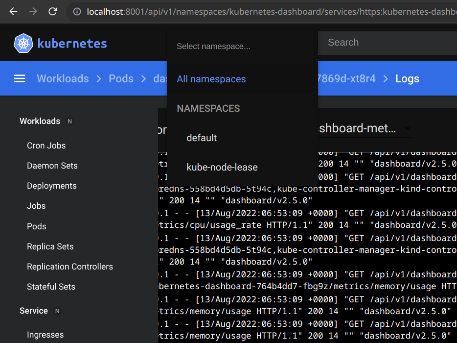

# [K8s dashboard](/2022/08/k8s_dashboard_and_kubectl_proxy.md)

minikube dashboard 傻瓜命令可安装，但是在 kind 我可以 apply yaml 这样去学习

```
[w@localhost ~]$ kubectl apply -f https://raw.githubusercontent.com/kubernetes/dashboard/v2.5.0/aio/deploy/recommended.yaml

[w@localhost ~]$ kubectl get pod -A 
NAMESPACE              NAME                                         READY   STATUS    RESTARTS      AGE
kube-system            coredns-6d4b75cb6d-7t4z5                     1/1     Running   3 (23m ago)   32m
kube-system            coredns-6d4b75cb6d-blx2z                     1/1     Running   3 (23m ago)   32m
kube-system            etcd-kind-control-plane                      1/1     Running   4 (22m ago)   32m
kube-system            kindnet-drg7p                                1/1     Running   3 (23m ago)   32m
kube-system            kube-apiserver-kind-control-plane            1/1     Running   4 (22m ago)   32m
kube-system            kube-controller-manager-kind-control-plane   1/1     Running   4 (22m ago)   32m
kube-system            kube-proxy-tl997                             1/1     Running   3 (23m ago)   32m
kube-system            kube-scheduler-kind-control-plane            1/1     Running   4 (22m ago)   32m
kubernetes-dashboard   dashboard-metrics-scraper-7bfdf779ff-nwp72   1/1     Running   0             2m6s
kubernetes-dashboard   kubernetes-dashboard-6cdd697d84-bdf8b        1/1     Running   0             2m6s
local-path-storage     local-path-provisioner-9cd9bd544-lj7lb       1/1     Running   4 (23m ago)   32m
```

## kubectl proxy

然后开一个 kubectl proxy 代理服务器的网关在后台就能访问

> systemd-run --user kubectl proxy

<http://localhost:8001/api/v1/namespaces/kubernetes-dashboard/services/https:kubernetes-dashboard:/proxy>

打开时会提示需要输入 token

## ServiceAccount token

说起 token 想起公司的每个 pod 都有这样一个 mount: /var/run/secrets/kubernetes.io/serviceaccount

可能是用于 pod 跟 K8s api server 之间鉴权

由于 KUBERNETES_SERVICE_HOST 相关环境变量可能拿不到所以我都是根据上述文件判断 Rust 进程运行在一个 K8s pod 中

<https://github.com/kubernetes/dashboard/blob/master/docs/user/access-control/creating-sample-user.md>

```
kubectl config set-context --current --namespace=kubernetes-dashboard 
kubectl config view --minify | grep namespace:
kubectl -n kubernetes-dashboard get ServiceAccount
NAME                   SECRETS   AGE
admin-user             1         4m8s
default                1         14m
kubernetes-dashboard   1         14m(这个可能是照着 creating-sample-user 建出来的)

kubectl delete -f dashboard-adminuser.yaml
serviceaccount "admin-user" deleted
```

拿默认用户的 token `kubectl -n kubernetes-dashboard create token default` 进去 dashboard 网页看啥都没权限

creating-sample-user 文档里好像说本来应该用 kubeadm 创建用户，还是老老实实 apply 文中两个 yaml(serviceaccount+clusterrolebinding)

最终能使用 dashboard 了，记得先选上 all namespace (因为我默认 namespace 没有 pod)


