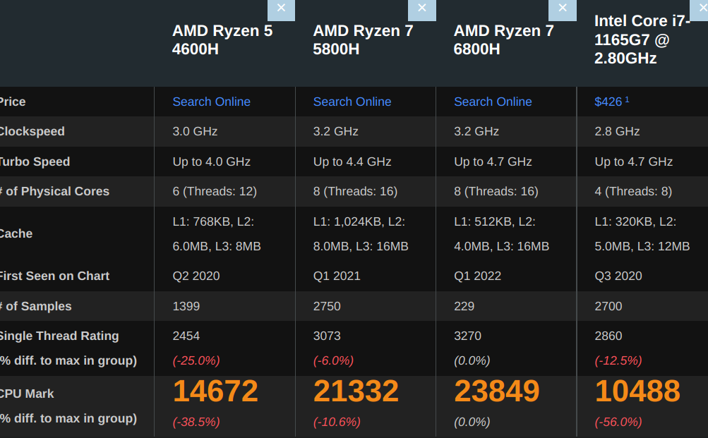
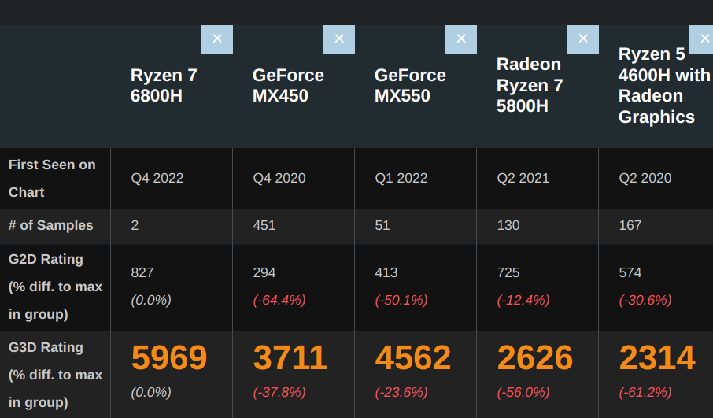

# [compare cpu/gpu](/2022/11/cpu_gpu_benchmark.md)

## windows get cpu info

systeminfo 获取到的不是 CPU 型号...

> AMD64 Family 23 Model 96

wmic cpu get name

> AMD Ryzen 7 4800H with Radeon Graphics 

## CPU/GPU benchmark

荣耀 magicbook pro 21 初我买的锐龙 4600H

当我哥 22 年底买的荣耀同款模具时候能用上 5800H

于是我想对比下时隔两年同样的价格性能上有多少提升

cpubenchmark.net 和 videocardbenchmark.net 右上角有一个市场秤的图标

可以搜索选中两个处理器进行对比

可见 5800H 比 4600H 的 CPU 性能强了 50% 不止

而 GPU 性能 5800H 的性能提升相比前一代也就 10%，而 6800H 显卡性能比上一代翻倍有多，已经完爆 22 年第一季度的 MX550 笔记本低功耗独立显卡

据极客湾说，明年的 7800H 换了新架构，CPU/GPU 可能都有质变
