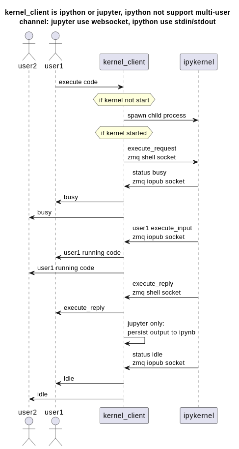
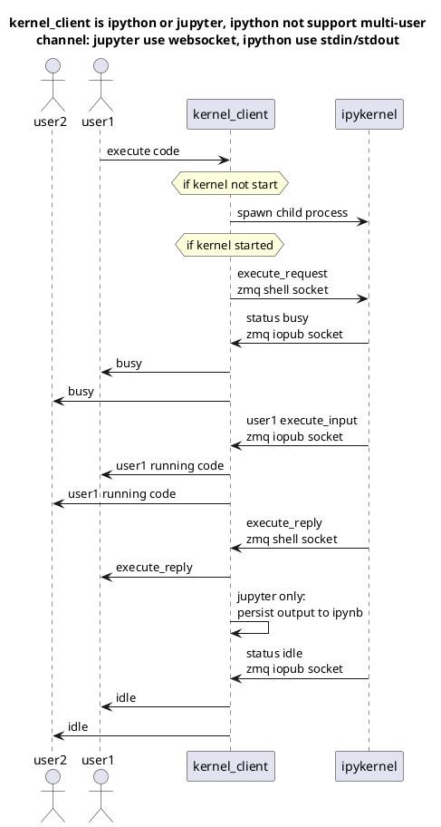
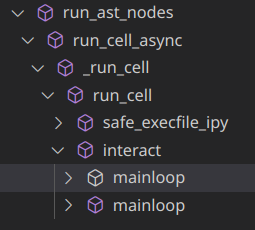

# [ipython 画图原理](/2022/12/how_ipython_plot_matplotlib.md)

在我的
[ipython kernel source code explain](https://github.com/pymongo/jupyter_notebook/blob/master/ipython_kernel_source_code_explain.ipynb)
中大致解释了部分 jupyter 的实现原理

在 ipython/jupyter 执行代码的流程图如下





jupyter 其实就是 ipython kernel client 之上加了一个 ipynb 读写/websocket 消息转发/广播的模块，实现多人协同编辑

且通过 ipykernel 自身的 idle/busy 状态确保同一时间只能有一个用户运行代码

---

以前想过 jupyter/ipython 无非就 eval 用户输入的代码块，或者能不能将代码写入临时的 py 文件，再运行取结果

首先很快就否定掉单独运行一个 py 文件的方案，这样只能从 stdout 拿输出结果

而 ipython 设计了 `__repr_html__` 等属性可以可视化执行结果的数据

意味着 ipykernel 必须要拿到最后一个表达式的结果对象，再取 html 属性返回给用户前端取渲染

python 执行一段字符串代码主要有两个函数，一个是 exec 一个是 eval

exec 能执行一大段代码但是没有返回值，eval 只能执行一个表达式会返回结果

一大段代码扔给 eval 取执行是不行的，eval 无法执行多个 ast statement 的例如 class/function 定义等等

所以 ipykernel 的做法是分割出最后一个表达式，最后一个表达式之前的代码 exec 去执行，到了最后一个表达式就 eval 执行

## run_ast_nodes

本文代码的行号以 ipython 源码的 7.34.0 版本的 TAG 为准n

> git checkout tags/7.34.0

ipykernel 的核心代码都在 IPython/core/interactiveshell.py

```python
# IPython/core/interactiveshell.py:3425 def run_ast_nodes

if not nodelist:
    return
# ...
if interactivity == 'last_expr':
    if isinstance(nodelist[-1], ast.Expr):
        interactivity = "last"
    else:
        interactivity = "none"

if interactivity == 'none':
    to_run_exec, to_run_interactive = nodelist, []
elif interactivity == 'last':
    to_run_exec, to_run_interactive = nodelist[:-1], nodelist[-1:]
```



首先 ipython 会先调用标准库的 ast.parse 将字符串的代码编译出 `List[Statement]`

熟悉 Rust AST/过程宏的我发现 Python 和 Rust 一样 Expr 只是 Stmt 的其中一种

ipython 源码这主要将代码分了三种情况

1. 输入为空 ast.parse 得到的也是空，啥也不干就行
2. 最后一个语句不是表达式，整段代码 exec 去执行即可
3. 最后一个语句是表达式，先 exec 执行最后一个语句之前

```python
# IPython/core/interactiveshell.py:3464 def run_ast_nodes

to_run = []
for node in to_run_exec:
    to_run.append((node, 'exec'))

for node in to_run_interactive:
    # 批注: single 就是 eval 一个表达式的意思
    to_run.append((node, 'single'))

for node,mode in to_run:
    if mode == 'exec':
        mod = Module([node], [])
    elif mode == 'single':
        mod = ast.Interactive([node])
    # 批注: compiler 就是 compile 内置函数
    with compiler.extra_flags(getattr(ast, 'PyCF_ALLOW_TOP_LEVEL_AWAIT', 0x0) if self.autoawait else 0x0):
        # 批注: 如果 compiler 失败会捕获异常，部分运行时异常通过 ipython 修改的 sys.exception_hook 捕获
        code = compiler(mod, cell_name, mode)
        code = self._update_code_co_name(code)
        asy = compare(code)
    # 批注: compile 得到的 codeobj 最终在 self.run_code 函数内执行
    if (await self.run_code(code, result,  async_=asy)):
        return True
```

上述执行方式遇到 matplotlib 就遇到问题了，如果用户代码的 plt.show() 或者 plt.plot() 不是最后一个表达式

那么 exec 执行的时候无法获取到 plot/show 画图返回的 matplotlib.lines.Line2D 对象中的 html 属性

那么 ipython 是如何解决这个问题的呢？

## custom mpl backend

IPython/core/interactiveshell.py:3634

这里大致会改 matplotlib 的渲染后端成 matplotlib.use("module://matplotlib_inline.backend")，当然改 MPL_BACKEND 环境变量也行

matplotlib_inline/backend_inline.py

`shell.events.unregister('post_execute', flush_figures)`

ipython 的定制 mptplotlib backend 有一个额外的非 mpl 约定的 API

flush_figures 不是 mpl 约定的，ipython 把 flush 加到了 post_execute 回调函数的钩子中执行

实现了即便图是 plt.plot 不是最后一个表达式也能暂存起来，每次代码执行完再把暂存的图 flush 出来
