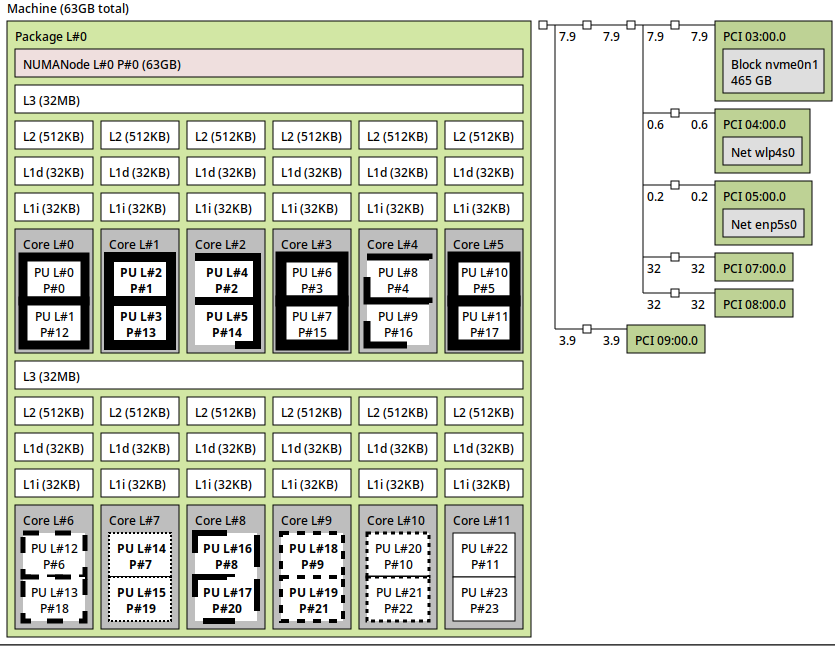

# [numactl](/2022/12/numactl_lstopo.md)

# [numactl](/2022/12/numactl_lstopo.md)

之前只知道通过 lstopo 或者 lstopo-no-graphics 命令查看机器的 NUMA 节点信息

NUMA 意思是多 CPU socket 多内存的的主板/设备上，但由于 CPU 跨 NUMA 节点同步数据延迟很高性能较差所以用的不多

最近看 <plantegg.github.io> 的博客还学到了 `numactl -H` 命令可以查看机器的 NUMA 节点信息

