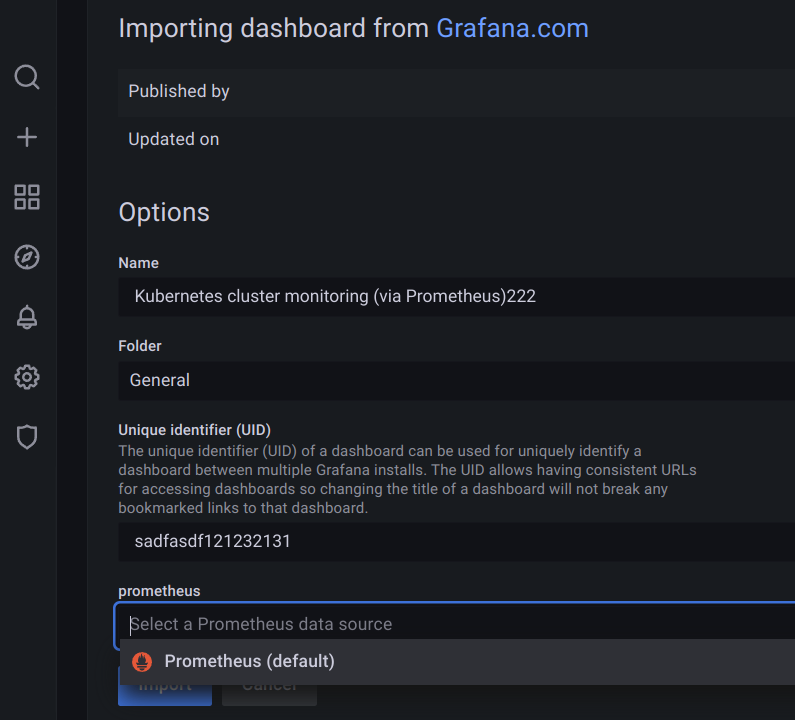
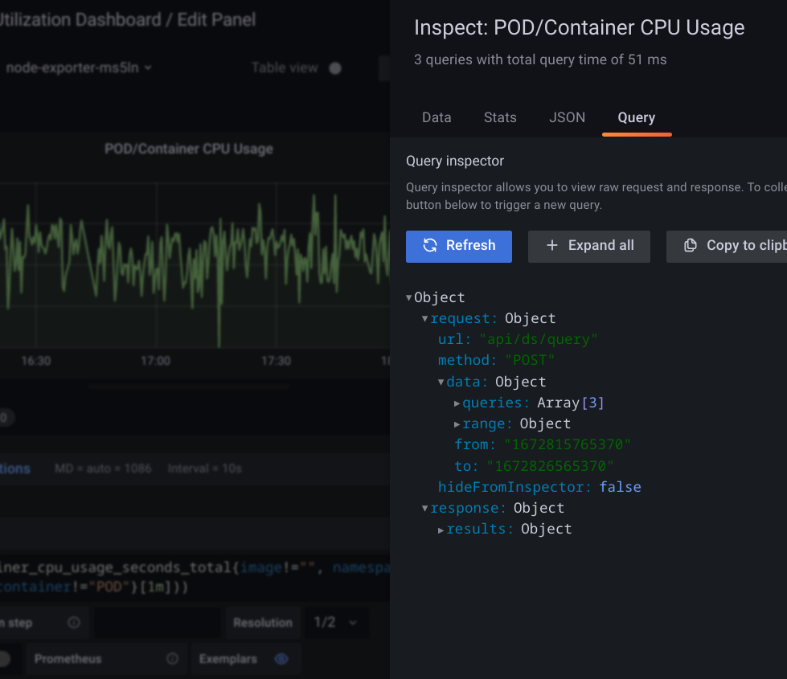

# [grafana query cpu usage](/2023/01/grafana_query_inspect_prometheus_pod_cpu_usage.md)

想要查 pod 的 cpu 使用率时序数据，K8s 已装 metrics-server, node-exporter, prometheus, grafana 等等

不会写 PromQL 可以抄一份别人的配置和查询

## grafana 导入别人的 dashboard

以我看的这边文章为例 <https://juejin.cn/post/7145097927067697159>

作者在 grafana dashboard marketplace 中的 id 是 3119

grafana 左侧菜单 dashboard->browse->import

粘贴 3119 的链接 <grafana.com/grafana/dashboards/3119>

**导入前记得选 data source 为自己的 prometheus**



然后就能看到监控图表了

---

## pod cpu usage

我导入了 `Kubernetes Pods/Containers Resource Dashboard` 

图表顶部的有个 label 选中想看的 pod, 再选中 CPU usage 的 panel 的标题栏点 edit

最后点 query_inspector->query->refresh 然后就能得到请求 prometheus 的 json 格式去拿到 CPU 使用数据



grafana 的 query json 跟普罗米修斯 API 查询不太一样

```python
import requests
import urllib.parse
query='sum by (pod) (rate(container_cpu_usage_seconds_total{namespace="host", pod="node-exporter-ms5ln", container="node-exporter"}[1m]))'
query=urllib.parse.urlencode({
    "query": query
})
url=f"http://prometheus:9090/api/v1/query?{query}"
rsp=requests.get(url)
print(rsp.status_code, rsp.text)
```

普罗米休斯的接口返回值为

> 200 {"status":"success","data":{"resultType":"vector","result":[{"metric":{"pod":"node-exporter-ms5ln"},"value":[1672832950.772,"0.036715530525449035"]}]}}
