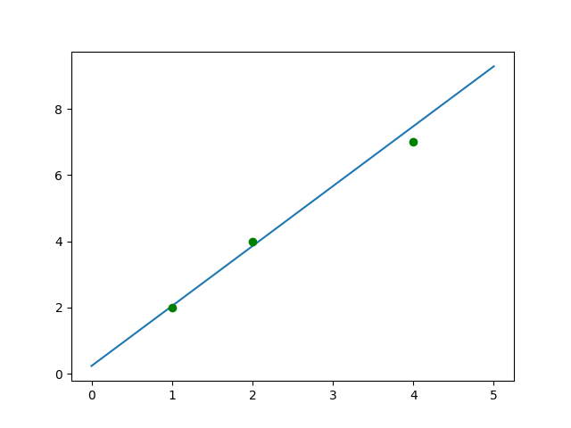

# [sklearn 最小二乘/解方程](/2023/02/sklearn_regression_least_squares.md)

数学建模问题: 汽车行驶 1km 路消耗 2L 汽油，记录为 (1,2)，先前三次记录分别是 (1,2), (2,4), (4,7)，问跑 10km 路需要准备多少汽油

如果是高中数学问题，两点确定一个条直线解一个二元一次方程就可以算出汽油跟路程之间的直线方程

但「观测数据存在误差」，例如 (4,7) 那次的观测由于开车过程中风力阻力过大导致数据有误差

所以不可能找到一条直线经过所有的点，也就是方程/矩阵没有确定解，只好找一个最优解拟合出误差最小的里程-油的直线

(联想到高中线性规划数学题，给出xy的约束条件大部分是个三角形的可行域，然后求一个 z=2x+y 之类的直线方程的最大值，也算最优解问题)

## 为什么方差不用绝对值

- 误差: 拟合值跟观测值之差
- 方差: sum((each - avg(nums)).pow(2)) 描述数据的离散程度
- 标准差: 方差的算术平方根

两数相减的平方方便去计算导数，绝对值函数不可微分，绝对值求出的最优解可能是一个区间，但是用平方就一定得到仅一个最优解

## 误差方差的偏导数

假如最终拟合的直线方差为 y=kx+b 代入我们的数据去算总的误差:

> (k+b-2)^2 + (2*k+b-4)^2 + (4*k+b-7)^2

在 mathway.com/Algebra 输入表达式并输入 factor 操作帮我整理得:

> 21k^2+14bk+3b^2-26b-76k+69

笔者数学知识有限，只能记住分别对 k,b 求偏导数能得到最值，证明略，就像高中数学知识有限做线性规划题只能画图法画出可行域三角形，然后挪动直线方程找最值这样脑补法而无法用矩阵等理论找出公式

!> x^n 的导数是 n*x^(n-1), 对 x 求偏导数的时候，y 不变所以 y^2 可看作常量求导一次变成 0

- 对 k 求偏导数: 42k + 14b - 76 = 0
- 对 b 求偏导数: 6b  + 14k - 26 = 0

## ChatGPT 解方程

搜索二元一次方程的关键词 Linear Equations in Two Variables，注意谷歌翻译二元一次方程的`quadratic equation`实际上是一元二次方程

一开始 AI 给了一个小学数学版本的消元法、换元法等等，于是我又想问，能不能用大学数学里的线性代数矩阵运算去解方程

> how to solve Linear Equations in Two Variables

```
You can use matrices to solve linear equations in two variables by setting up an augmented(增加) matrix and performing row operations to reduce the matrix to row echelon(梯队) form or reduced row echelon form. Here's the general process:

Write the system of equations in matrix form. For example, the system

2x + 3y = 8
4x - y = 1

can be written as

[ 2 3 | 8 ]
[ 4 -1 | 1 ]

The first column contains the coefficients(系数) of x, the second column contains the coefficients of y, and the third column contains the constants on the right-hand side of each equation.

Use row operations to reduce the matrix to row echelon form. The goal is to create zeros below the diagonal in the first column. Here's one way to do it:

a. Multiply the first row by -2 and add it to the second row to get:

[ 2 3 | 8 ]
[ 0 -7 | -15 ]

b. Multiply the second row by -1/7 to get a leading coefficient of 1:

[ 2 3 | 8 ]
[ 0 1 | 15/7 ]

Use row operations to reduce the matrix to reduced row echelon form. The goal is to create a diagonal of 1's and zeros above and below the diagonal. Here's one way to do it:

a. Multiply the second row by -3 and add it to the first row to get:

[ 2 0 | 23/7 ]
[ 0 1 | 15/7 ]

b. Multiply the first row by 1/2 to get a leading coefficient of 1:

[ 1 0 | 23/14 ]
[ 0 1 | 15/7 ]

Read off the solution. The first column of the matrix gives the solution for x, and the second column gives the solution for y. In this case, the solution is x = 23/14 and y = 15/7.
```

## Python 解方程

chatGPT 问完了矩阵解方程，现在我给出 Python 代码的实现

```python
# 42k + 14b - 76 = 0
# 6b  + 14k - 26 = 0
mat = Matrix([
    [42, 14, 76],
    [14, 6, 26]
])
mat_rref: Matrix = mat.rref()[0]
pprint(mat_rref)
print(mat_rref.values)
```

解得 k=23/14≈1.64, b=1/2 跟我们数据集 (1,2), (2,4), (4,7) 中耗油量是里程的两倍接近

算下最终误差为 0.24

```python
k=23/14
b=0.5
error = 0
for x, y in [
    (1, 2),
    (2, 4),
    (4, 7)
]:
    error += (k*x+b-y)**2
print(f"k={k}, b={b}, error={error}")
```

## scipy 最小二乘

```python
import scipy.linalg
import numpy as np

x = np.vstack([1, 2, 4])
y = np.vstack([2, 4, 7])
# rank Only available when X is dense(密集)
sol, residues, rank, s = scipy.linalg.lstsq(x, y)
k = sol[0][0]
b = residues[0]

# 可视化
xi = np.linspace(0, 5, 1000) # 1000 step between 0-5
yi = k * xi + b
x = np.rot90(x)[0]
y = np.rot90(y)[0]
assert len(xi.shape) == len(x.shape)
assert len(yi.shape) == len(y.shape)
import matplotlib.pyplot as plt
plt.plot(xi, yi)
#plt.scatter(x, y)
# g=green, o=plt.scatter(x, y, color='green') scatter 就是散点图
plt.plot(x, y, 'go')
plt.show()
```

scipy 算出来的斜率 k 和偏移 b 跟我们之前算的不一样，可能 scipy 内部默认的算法参数不同导致 scipy 算出的误差比我们的 0.24 误差大点，需要调节下算法参数



## sklearn 线性回归

```python
from sklearn import linear_model
import numpy as np

x = np.vstack([1, 2, 4])
y = np.vstack([2, 4, 7])

reg = linear_model.LinearRegression()
# fit 就是拟合的意思, x 和 y 并称训练数据集
# x 是 feature column/value; y 是 label/target
reg.fit(x, y)
k, b = reg.coef_[0][0], reg.intercept_[0]
print(f"k={k}, b={b}")
```

sklearn 算出的跟我们手动偏微分算出的结果完全一致

跟之前提到的矩阵 rref 一样，用 sklearn 线性回归拟合实际上也能解方程

## 梯度下降法找最值

三维几何空间凹平面中有座山，如何从山顶找到最低点山谷

梯度下降法思路就是找出斜率最高点走一步，再找斜率最高点走下一步如此循环

山的高度就是 SSE(误差平方和) 的损失函数，通过超参数步长 alpha 来限制迭代速度

## 线性回归机器学习

从最小二乘法推广/归纳出的线性回归，大概是最简单的机器学习算法了

机器学习主要就两类算法: 回归 和 分类/聚类(包括推荐算法)

先看看 skelarn 内置的无需联网下载中唯一的 regression 类型数据集  diabetes(糖尿病)

```python
from numpy import ndarray
from sklearn.datasets import load_diabetes
sample: ndarray = load_diabetes()
print(sample["DESCR"])
```

看文档知道 `sample["data"]` 是特征数据集(400 多行 10 列)， `sample["target"]` 是 target 值，

为了简单起见我只用第十列 `glu, blood sugar level` 做一个血糖水平-糖尿病的模型

ndarray 的二维数组可以通过这样的表达式 `feature[:, 9:10]` slice 出第 10 列 only

打印其中部分数据发现有正有负且数值区间都在 0.05 左右，血糖怎么可能是负数，有点像是归一化处理后的数据

## 归一化/特征缩放

有些数据离散程度过高，需要预处理等比缩放为 [-1, 1] 或 [0, 1] 之间，其中最小值会缩放成 -1 最大值会缩放成 1，其余数据等比缩放到 -1 和 1 之间

这个过程也叫 normalization


---

Reference:
- [搞懂最小二乘法](https://blog.csdn.net/MoreAction_/article/details/106443383)
- [机器学习模型评估指标](https://zhuanlan.zhihu.com/p/86120987)
