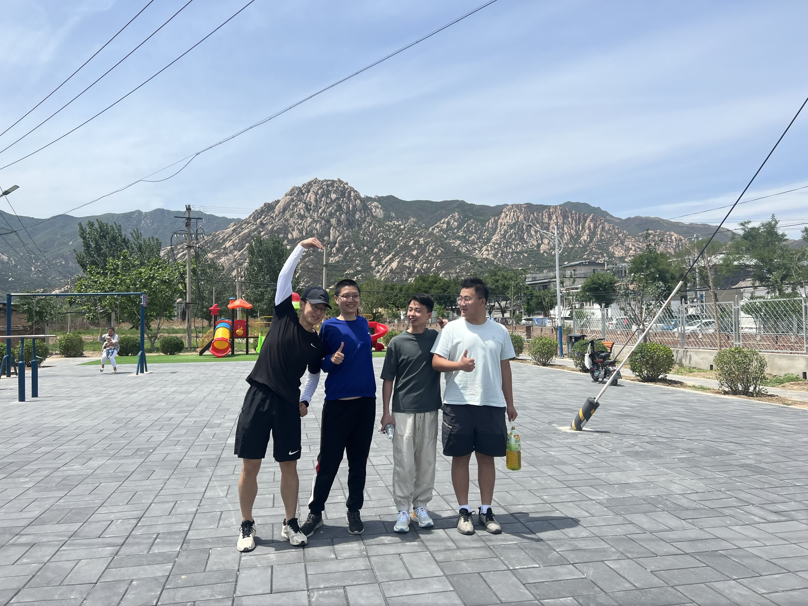
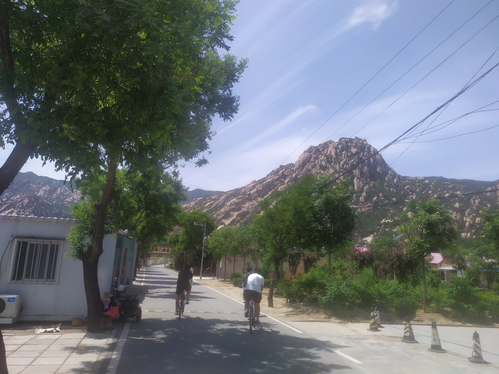
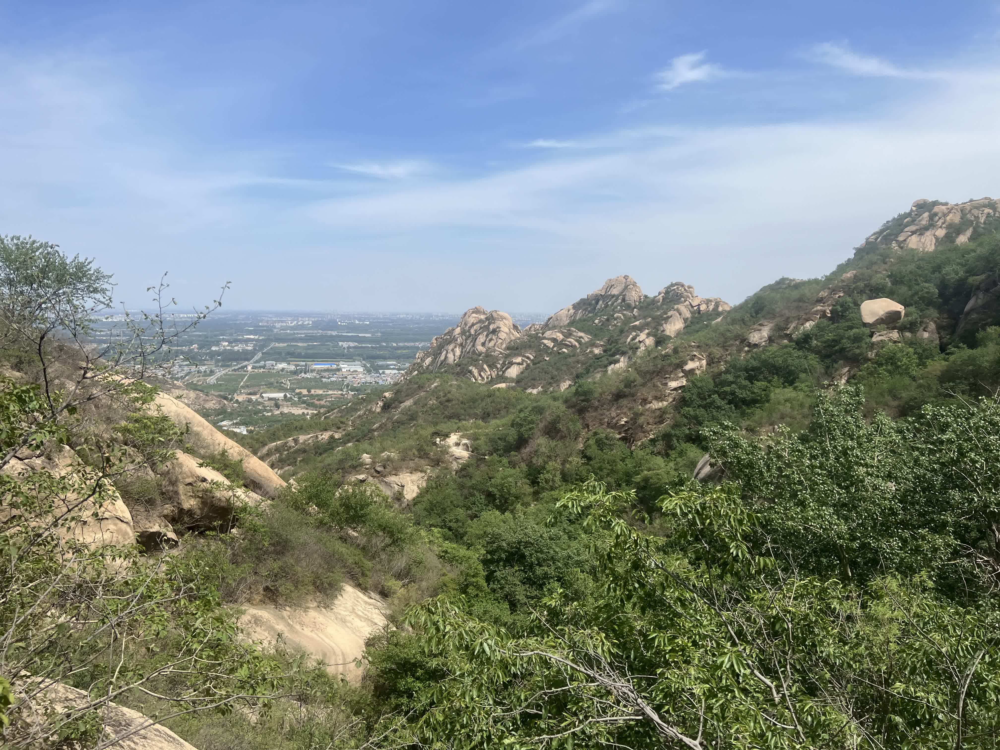
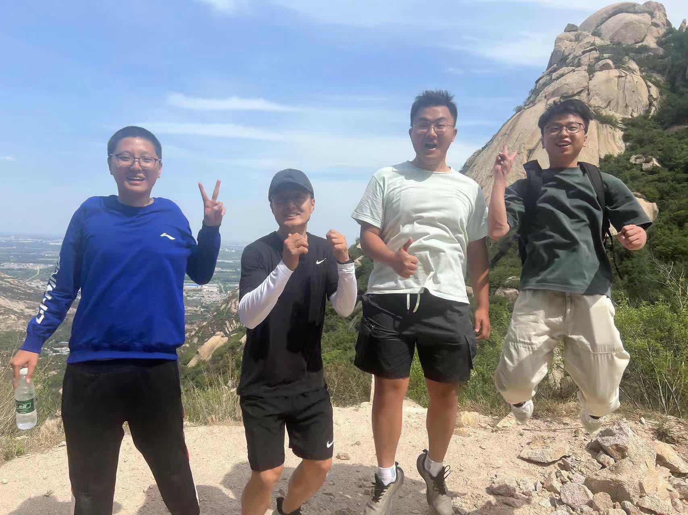

# [北京后花园游记](/2023/05/beijing_back_yard_tour.md)

上周的明十三陵之旅还算愉快，这周也让一个即将离职的同事加入一起骑行，只是没想到活动组织人在骑行后几天光速离职，等于说骑行的四人有一半都离职了，也算是个送别会了

继续在华北电力大学十点集合，队长迟到了再加上我和另一队友走错路了，直到十一点半才到后花园景区山下的白虎涧村

吸取上次我小轮子自行车速度过慢，扫了一辆美团新款非机械锁的车(伏笔)

考虑到有队友没吃早饭，十一点半在白虎涧村吃了一顿川菜，烤鱼还不错，饭后在村里的健身器材附近，背靠后花园景区拍了个合照

从沙阳大道到白虎涧，再从白虎涧上山，一路上都是很少车的林荫小道很舒适

后花园景区 90% 的路都是没铺好的全是碎石头和沙子的烂路，那么烂的路门票还能卖六十

进门左边第二条上山路，有条「飞锁道」，没有台阶，只有双手扶着一条铁索，山壁有不少凹槽脚踩攀岩，好在坡度不陡，我手扶着铁链重心贴着山壁克服恐高慢慢爬上去

花了一小时走到山顶，脚底都被碎石头踩的疼到像做了个足疗足底按摩一样

山顶风景很美，但没有防护栏(有点恐高)

下山的时候，app 提示美团共享车乘客远离车子太远了自动锁车了，然后扫码骑车的时候又说服务区外不能骑

同事骑的支付宝车也是电子锁距离过远自动锁车，然后提示服务区外锁车罚款几十，除非把车骑回服务区内

只好走回白虎涧村的公交站我先行坐公交回去了
