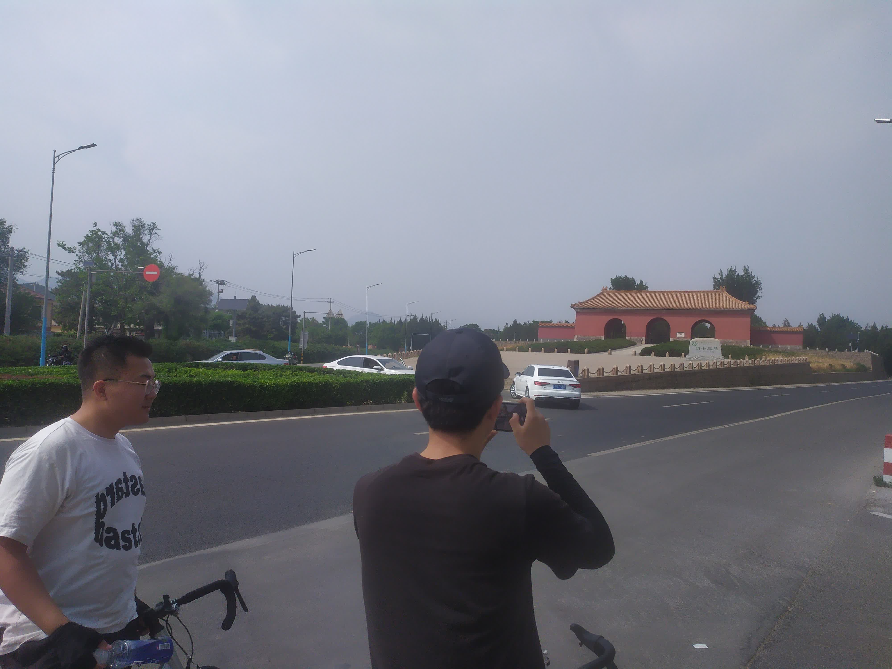
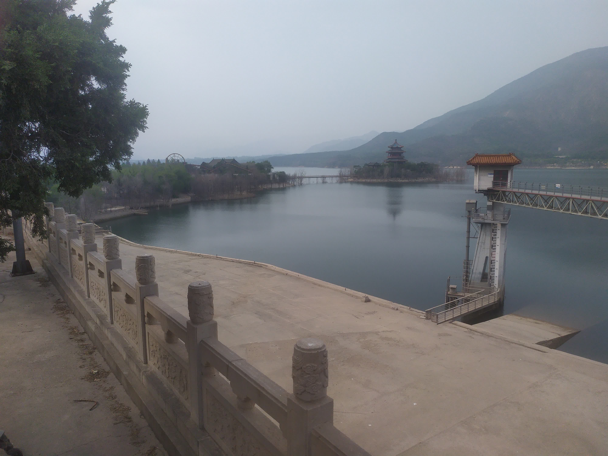
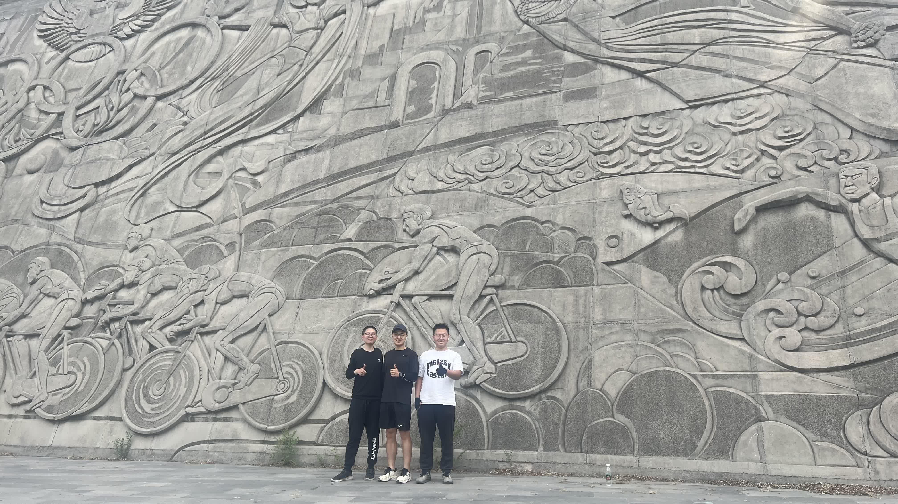

# [明十三陵骑行](/2023/05/bike_tour_to_mings_tombs.md)

同事 A 喊了好久要不要一起去十三陵了他自己独自骑过好几回说景色不错，同事 B 也是骑行爱好者，他两都是骑 1500+ 的高级自行车

而我骑的是小轮子休闲代步车，别人蹬一圈顶我蹬两三圈的距离

## 路线
- 育知路->华北电力大学集合->生命科学园地铁站->沙河->水屯->昌平县城西
- 昌平县城->十三陵大红门->十三陵水坝->昌平县城东->石油/政法大学->原路返回

13:15 集合，17:45 到家，往返约 70km

我上次长途骑行还是大学时从天津双林一直骑到滨海新区的海边，往返全程 80km (还有次往返 30km 去津南区南面的不算远就不计)

## 沿途风景

从海淀区学院路到清河，沿着国道京藏高速一路向北，沙河后面一路上基本都是农田，除了昌平体育馆有些地标性标志着从城郊的农田进入到昌平县城

我小轮子车骑到水屯附近就掉队跟不上他们高级车了，去程体力旺盛还没脱力还能咬紧在 500m 内，返程的时候过于疲劳(骑完后大腿疼了三天)驾驶足足让前面的同事等了我 4km

---

## 十三陵

十三陵大红门入口附近清一色全是樱桃🍒采摘园和卖樱桃的小贩，可能由于疫情原因，路边商业街的固定摊位的空闲吃灰了，倒是以三轮车卖樱桃的小贩为主

水库路往东骑行 4/5 路程后走到水坝处，水坝旁边有个"湖心岛"很漂亮的庙宇，可惜广播说十三陵水库近几年溺死十几人，已经不开放给游客进湖心岛和水库边观光了。

水库路出来就是繁华的昌平县城市中心，尤其是石油传媒大学那个十字路口繁华的就像三环内

最后放一个在水库入口的合照，左一是博主

