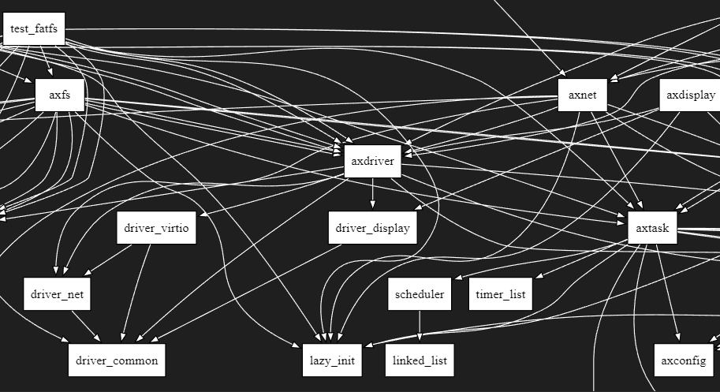

# [arceos 如何解决循环依赖](/2023/08/arceos_crate_interface_solve_circular_dependencies.md)

操作系统内核复杂性导致内核模块互相依赖耦合度很高，C 的编译链接设计不存在循环引用的问题

Rust 知名库 sqlx 循环引用的痛苦导致 rust-analyzer 无法工作，arceos 考虑到开发者的人体工学/开发体验必须要让 ra 正常工作

crates/crate_interface/README.md 文档中解释了 crate_interface 机制解决循环引用的设计

<https://www.bilibili.com/video/BV1kz4y1a7bD/?p=2&spm_id_from=pageDriver>

Rust 还没稳定 ABI 借鉴了 C ABI?

crate_interface 宏展开之后就是一个 FFI 函数调用
