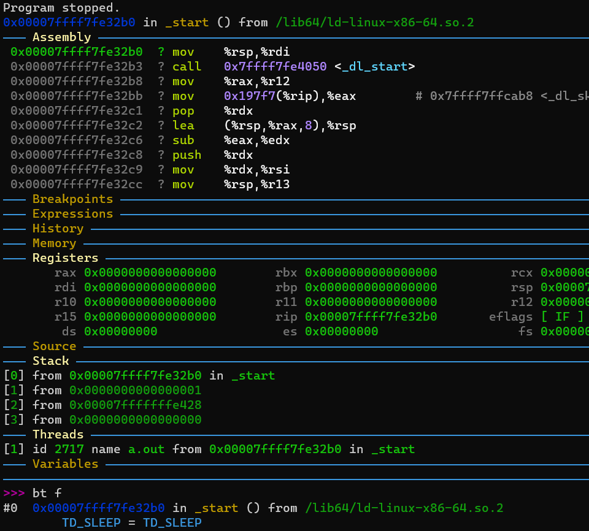

# [jyy 操作系统笔记](/2023/08/jyy_operate_system_notes.md)

我被[游戏外挂视频](https://twitter.com/ospopen/status/1691635355848765886)吸引进 jyy 的操作系统课(最喜欢 2022 版敲代码部分比较多)

## C 实现继承/多态黑魔法
[生存指南](https://jyywiki.cn/OS/OS_Guide.html)里演示了虚函数多态和多继承的实现，国汽智能网联的 r4l 课程里面讲 Linux 源码的时候提到有不少结构体用到了类继承的写法

> 一些技巧来实现类似于继承的概念。这通常被称为结构体的嵌套。通过在一个结构体中嵌套另一个结构体，可以实现某种形式的代码复用和属性继承，并不是严格意义上的类继承

linux 源码中习惯把 dyn trait 类型命名成 xxx_ops, 对应 Rust for Linux 的 #[vtable] 宏?

## AbstractMachine
代码仓库应该是: <https://github.com/NJU-ProjectN/abstract-machine>

文章有个错误案例是 64-bits 汇编解析成 32-bit 指令导致 Segmentation Fault

好消息是不用像 rcore 那样手搓 linker script, elf 似乎编译成 MBR 引导?

### 复位后只关心 cr0 和 cs/ip 寄存器
cr0 是处理器当前运行在 16/32/64 哪种 bits 模式, rip=pc=cs<<4+ip

## gdb
jyy 视频里面 gdb 的配置好花哨，想起了 rcore 里面推荐的 gdb-dashboard

(图为 starti 停在程序的第一个指令和 bt full 命令)

### layout asm
弹出汇编代码的上半窗口

### info threads/inferiors 区别
info threads：这个命令用于显示程序中所有线程的信息。它会列出每个线程的唯一标识符（thread ID），当前所在的函数调用栈，以及其他线程相关的信息。您可以使用 info threads 来查看程序中所有线程的状态和调用栈信息，以便分析和调试多线程程序。

info inferiors：这个命令用于显示程序中所有子进程的信息。在 gdb 中，一个调试会话可能包含多个子进程，例如多进程程序或调试器本身产生的辅助进程等。info inferiors 命令可以显示每个子进程的唯一标识符（inferior ID），当前被调试的二进制文件路径，以及其他子进程相关的信息

### !cat /proc/2717/maps
gdb 里面打印进程地址空间映射，注意不能用 /proc/self 不然打印成 cat 自身的

## 其他工具的使用
vim `:!gcc` 可以执行命令，这个我忘了好几年了
