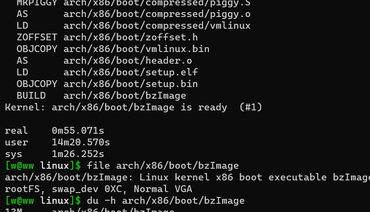
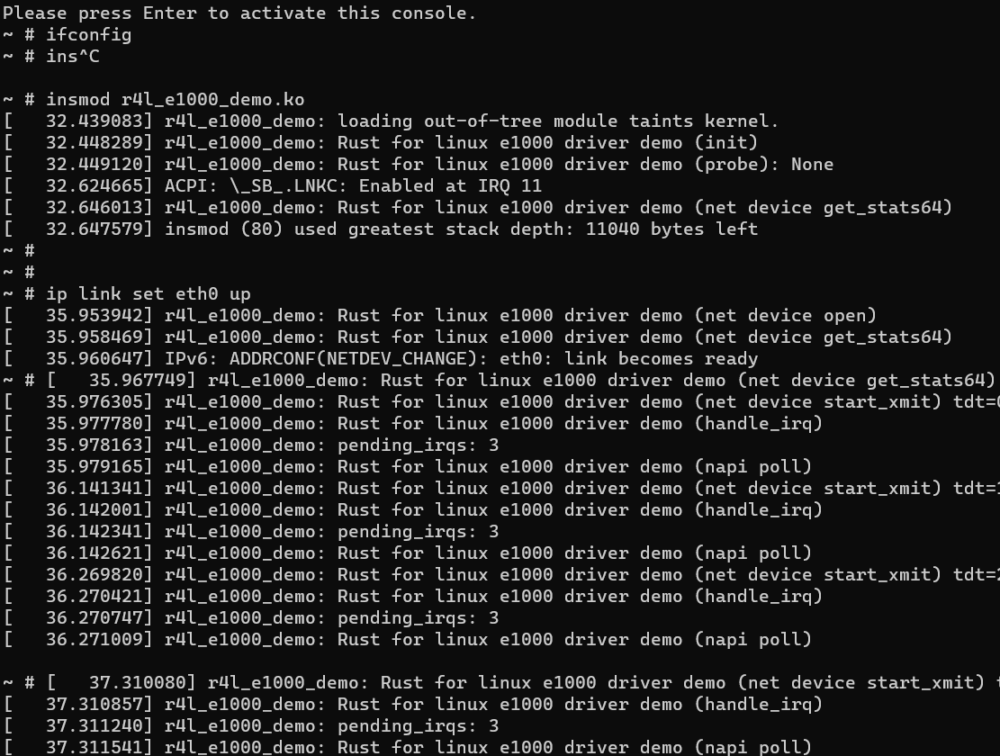
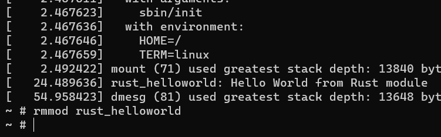
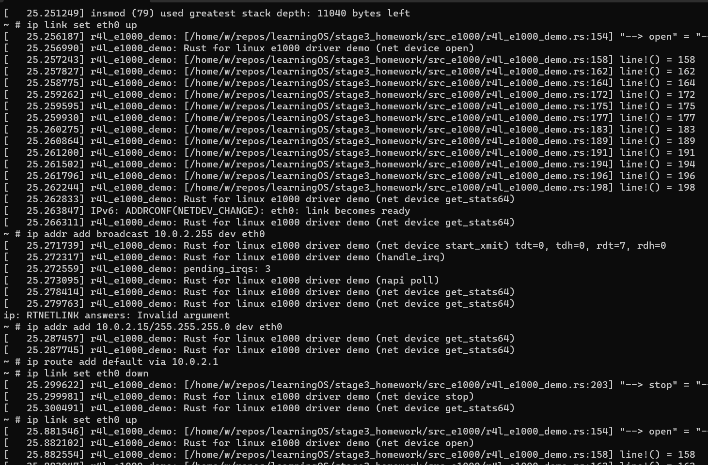

# [Rust for Linux 网卡驱动](/2023/08/rust_for_linux_network_driver.md)

## r4l 实验报告
|||
|---|---|
|实验报告网页版(持续更新)|<https://pymongo.github.io/2023/08/rust_for_linux_network_driver.md>|
|实验指南|<https://docs.qq.com/doc/DY2RVVFNoa3dxS2Vh>|
|我的 fork|<https://github.com/pymongo/stage3_homework>|



图一实验一结果 调整参数编译内核



实验二截图，实验前禁用了 Intel 网卡所以 ifconfig 应该空白输出，由于 Rust 驱动疯狂打印日志导致难以在一个截图中包含五次命令操作的记录

```
~ # ip addr add broadcast 10.0.2.255 dev eth0
[   40.427431] r4l_e1000_demo: Rust for linux e1000 driver demo (net device get_stats64)
[   40.430088] r4l_e1000_demo: Rust for linux e1000 driver demo (net device get_stats64)
ip: RTNETLINK answers: Invalid argument
```

中途有个命令报错了，但是不影响使用



实验三如上图，dmesg 中可见 Rust 模块的打印



实验四 网卡反复 up/down, 思考为什么 lspci 看不到网卡

## 别浪费时间搞 out-of-tree-module
一年前我写过文章探索 r4l out of tree module 编译(毕竟这样方便点用少量文件完成构建，不用在 linux 源码中构建只能 qemu 执行)，现在 Manjaro 也有 6.1 内核了先试试看

```
origin	https://github.com/Rust-for-Linux/rust-out-of-tree-module.git (push)
[w@ww rust-out-of-tree-module]$ zcat /proc/config.gz | grep _RUST
CONFIG_HAVE_RUST=y

  RUSTC [M] /home/w/repos/learningOS/rust-out-of-tree-module/rust_out_of_tree.o
error: target file "./rust/target.json" does not exist
```

好吧，文档说了必须要有 `CONFIG_RUST=y` 选项我放弃了，再看看这位老哥的两篇文章编译内核开启选项也没能解决 <https://blog.rnstlr.ch/building-an-out-of-tree-rust-kernel-module-part-two.html>

更新: 当我 r4l 源码 make 成功后，加上 KDIR 重新构建

```
[w@ww rust-out-of-tree-module]$ make KDIR=../linux/
make -C ../linux/ M=$PWD
  RUSTC [M] /home/w/repos/learningOS/rust-out-of-tree-module/rust_out_of_tree.o
error[E0050]: method `init` has 1 parameter but the declaration in trait `kernel::Module::init` has 2
  --> /home/w/repos/learningOS/rust-out-of-tree-module/rust_out_of_tree.rs:20:22
   |
20 |     fn init(_module: &'static ThisModule) -> Result<Self> {
   |                      ^^^^^^^^^^^^^^^^^^^ expected 2 parameters, found 1

[w@ww rust-out-of-tree-module]$ make KDIR=../linux/
make -C ../linux/ M=$PWD
  RUSTC [M] /home/w/repos/learningOS/rust-out-of-tree-module/rust_out_of_tree.o
  MODPOST /home/w/repos/learningOS/rust-out-of-tree-module/Module.symvers
  CC [M]  /home/w/repos/learningOS/rust-out-of-tree-module/rust_out_of_tree.mod.o
  LD [M]  /home/w/repos/learningOS/rust-out-of-tree-module/rust_out_of_tree.ko

sudo insmod ./rust_out_of_tree.ko
insmod: ERROR: could not insert module ./rust_out_of_tree.ko: Invalid module format
[314501.389747] rust_out_of_tree: version magic '6.3.0-g18b749148002 SMP preempt mod_unload ' should be '6.1.44-1-MANJARO SMP preempt mod_unload '
```

## kernel config
```
rustup override set $(scripts/min-tool-version.sh rustc)
rustup component add rust-src
cargo install -f --locked --version $(scripts/min-tool-version.sh bindgen) bindgen
bindgen --version
make LLVM=1 rustavailable

make menuconfig
# enable genernal->rust_support
# enable kernel_hacking->samples->rust

[w@ww linux]$ cat .config | grep _RUST
CONFIG_RUST_IS_AVAILABLE=y
CONFIG_RUST=y
CONFIG_HAVE_RUST=y

make -j$(nproc)
file vmlinux
```

以图形化的内核配置为例，方括号是只能选 y/n 尖括号的话还能选 m 也就是编译成模块但不嵌入到内核

## vscode ra&clangd
```
make LLVM=1 rust-analyzer # would generate rust-project.json? 其实是 make 内核之后也会生成

cat .vscode/settings.json
{"rust-analyzer.linkedProjects": ["rust-project.json"]}
```

clang 配置 <https://docs.qq.com/doc/DY0ZJZXhxZkNXZ3FH> 不用 bear 70% 的定义也能跳转，但例如 drivers/base/driver.c 里面 klist_next 找不到定义

以下是 gpt 的 linux 源码 clangd 配置，跟 r4l 课程文档一样也是需要用 bear

```
创建一个名为.clangd的文件夹，并进入该文件夹。
在.clangd文件夹中创建一个名为compile_commands.json的编译数据库文件。这个文件将用于为clangd提供编译信息。你可以使用Bear工具来生成编译数据库，具体操作可以参考前面提到的Bear工具的使用方法。
在.clangd文件夹中创建一个名为clangd.yaml的配置文件。这个文件将用于配置clangd的行为。
打开clangd.yaml文件，并根据你的需求进行配置。你可以配置诸如编译器路径、标准库路径、头文件搜索路径、代码风格等选项。具体的配置选项可以参考clangd的文档。
在代码仓库的根目录中执行以下命令启动clangd：clangd --compile-commands-dir=.clangd。这会告诉clangd在.clangd文件夹中查找编译数据库文件。
```

> bear -- make LLVM=1 -j$(nproc)

没用 bear ，即便用了以下 clangd 配置依然是只能解析 6-7 成符号，用了 bear 生成几十万行的 compile_commands.json 之后符号

```
{
    "rust-analyzer.linkedProjects": [
        "rust-project.json"
    ],
    "clangd.arguments": [
        "--compile-commands-dir=${workspaceFolder}",
        "--background-index",
        "--completion-style=detailed",
        "--header-insertion=never",
        "-log=info"
    ]
}
```

> linux 6.0 的源码已经超过两千万行了，即便是 understand 软件精简掉除 x86 以外代码的示例项目 ~/.config/SciTools/samples/linuxKernel/ 也是百万行

## busybox 与 initrd

> initrd是一个用于引导Linux内核的临时文件系统。它是一个包含根文件系统所需文件的初始 RAM 磁盘映像。initrd在引导过程中被加载到内存中，以便在启动时提供文件系统支持，用于加载必要的驱动程序、模块和其他文件，以使系统能够成功引导。一旦Linux内核启动并加载了真正的根文件系统，initrd就会被卸载并释放掉

```
创建文件系统目录：在你的工作目录下创建一个用于构建文件系统的目录，例如rootfs
$ cd rootfs
$ mkdir -p proc sys dev etc/init.d
$ mkdir -p etc/network
$ touch etc/passwd etc/group etc/fstab etc/network/interfaces
$ chmod a+rwX -R .
添加必要的配置：根据你的需求，编辑etc/fstab、etc/network/interfaces等文件，配置文件系统的挂载和网络设置
复制BusyBox可执行文件：在编译BusyBox时生成的可执行文件保存在BusyBox的输出目录中。将busybox可执行文件复制到rootfs目录下：
$ chroot rootfs /busybox sh
$ ln -s /busybox /bin/sh
$ mknod dev/console c 5 1
$ mknod dev/null c 1 3
安装BusyBox的applets：在chroot环境中运行BusyBox的install命令来安装applets。这将在rootfs目录下创建链接，使得这些applets可以在文件系统中使用：
/busybox --install -s
```

1. busybox 的 make menuconfig 记得开 Settings->Build BusyBox as a static binary
2. make -j($nproc)
3. make install

```
$ ls ../busybox/_install/
bin  linuxrc  sbin  usr

../busybox/_install/
├── bin
│   ├── arch -> busybox
│   ├── ash -> busybox
│   ├── base32 -> busybox
│   ├── base64 -> busybox
│   ├── busybox
│   ├── cat -> busybox
...

[w@ww src_e1000]$ busybox pwd
/home/w/repos/learningOS/stage3_homework/src_e1000
[w@ww src_e1000]$ ldd /bin/busybox
        not a dynamic executable
```

所以说所有可执行文件其实都是 static link 的 busybox 一个通过 argv[0] 判断执行哪个可执行文件的逻辑

最后用 cpio 将 rootfs 打包成一个文件

### /etc/init.d/rcS
开机初始化会执行的一段脚本，在 E1000 网卡驱动实验中是如下的内容

```
#!/bin/sh
mount -t proc none /proc
mount -t sysfs none /sys
#mount -t debugfs none /sys/kernel/debug

# /sbin/mdev -s 命令会启动 mdev 守护进程，它负责监听 /sys 目录下的设备事件，并根据设备事件的发生情况来加载和配置相应的设备驱动
/sbin/mdev -s
```

## poweroff/halt 关机
busybox 工具里面没有 shutdown, 关机用 poweroff, halt 关机后 qemu 虚拟机不会退出
```
~ # halt
~ # umount: can't unmount /: Invalid argument
swapoff: can't open '/etc/fstab': No such file or directory
The system is going down NOW!
Sent SIGTERM to all processes
Sent SIGKILL to all processes
Requesting system halt
[   48.029209] reboot: System halted
```

!> 注意 halt 跟 riscv 的 wfi 指令进入低功耗等中断待机模式不是一回事

## out-of-tree-module ra&clangd
用 linux 源码文件夹的 Makefile 给当前 out-of-tree module 生成， 至于 clangd 的 compile_commands 我也是引用 linux 目录下面的就行了

## 踩坑 out-of-tree ra 支持打 patch
~~米老师给的 r4l 代码太旧了，需要人肉更新下才能支持 ra~~

```
$ make -C ../linux M=$PWD rust-analyzer
No rule to make target 'rust-analyzer'
```

两个群友和老师说打 patch 能用，但我试了好久都没成功，~~暂时放弃~~

我直接用 r4l 的 ra out-of-tree PR 版本的代码就能给 out of tree 加上 ra 支持了

```
[w@ww rusty-linux]$ git remote -v
origin  https://github.com/vvarma/rusty-linux.git (fetch)
origin  https://github.com/vvarma/rusty-linux.git (push)
[w@ww rusty-linux]$ git log -1 --oneline --abbrev-commit --all --graph
* 33102ff30 (grafted, HEAD -> extmod/rustanalyzer, origin/extmod/rustanalyzer) scripts: `make rust-analyzer` for out-of-tree modules

make -C ../../rusty-linux M=$PWD rust-analyzer
```

但是很快问题又来了，原来 r4l 驱动课官方魔改/新增了很多 Rust 内核库，我向助教提问 linux/rust/dma.rs 找不到定义

> dma.rs这个官方那个rust for linux好像没有，是这次实验提供的linux下面的，所以你用官方的代码树生成的rust-project应该是找不到的

只好静下心分析 rusty-linux 和我的 linux 版本对比二者 make -d 结果并无收获，

于是按照我的经验 no rule make target 要么是没有用tab作为缩进检查了下缩进对的，要么是前置依赖不满足看了下 ra target 也没有

最后我突然发现 Makefile 大量 #if 条件编译，再对比下 patch

我以为根目录的 patch 就上下挪动 ra target 位置没啥意义，我就没有修改

最后走投无路试试看，没想到从 1800 行挪到 2000 行跳过了某个条件编译终于能让 out-of-tree-module 的 ra 运行成功了

## 测试启动/禁用网卡

```
insmod r4l_e1000_demo.ko
ip link set eth0 up
ip addr add broadcast 10.0.2.255 dev eth0
ip addr add 10.0.2.15/255.255.255.0 dev eth0 
ip route add default via 10.0.2.1
ip link set eth0 down
ip link set eth0 up
```

ip addr add broadcast 并不是必须的。通常，网卡初始化会自动为接口分配一个默认的广播地址，无需手动配置

ip addr add 10.0.2.15/255.255.255.0 dev eth0: 这个命令将IP地址10.0.2.15和子网掩码255.255.255.0添加到eth0接口。这个命令为eth0接口配置了一个具体的IP地址。

## 踩坑 Segment Fault

我一开始 stop 实现 `dev.netif_stop_queue(); dev.netif_carrier_off();`

不过第二次调用 open 会 Segment Fault，好在有 backtrace, demagle 一下符号能看出 Rust 函数名, 不过我懒得 qemu -S -s 了打日志定位到 `*data.rx_ring.lock_irqdisable()`

加上两行 `*data.tx_ring.lock() = None; *data.rx_ring.lock() = None;` 后 SegmentFault 出现在 `data.napi.enable();`

由于 data.napi.disable 方法是"私有的"，我改了下 r4l 源码总算通关了没有段错误

## follow up
能不能把 remove 也实现下，做到可重复 insmod/rmmod 不会资源泄露

## 同学们报错常见 FAQ

### Rust 模块签名报错
insmod 时 module verification failed

解决思路，禁用内核模块签名验证，以下两个内核配置 key 设置成空

```
CONFIG_SYSTEM_TRUSTED_KEYS=""
CONFIG_SYSTEM_REVOCATION_KEYS=""
```

### 为什么 stop 函数不能用 lock_irqdisable

```
这个问题我也遇到了。 仔细查了一下原因如下：
dma_free_coherent() 背后也是调用 dma_free_attrs() ，这个函数定义里有一个  WARN_ON(irqs_disabled())  意思是在 irq被禁用的条件下调用此函数来清理DMA内存，会报一个警告。 （具体原因，是某些平台上无法保证缓存一致性，必须在中断中清理DMA，详见 邮件列表：   https://lore.kernel.org/all/bfe85e97-2974-06ee-8c6d-f8e8a83348ea@arm.com/   ）

咱们的 tx_ring 和 rx_ring 是放在 SpinLock 里边的， 需要加锁， 很多时候用的 lock_irqdisable() 就是把中断禁用再提供锁里的内容， 如果在这个语境下，对DMA内存进行了清理， 就会报一个 WARN trace 

解决方案就是， 提前手动把 irq 清理掉，或者确认此时不必须 禁用irq ，直接调用 lock() 来获取 spinlock 中的内容 
```


---

以下是理论知识和源码解读

## r4l alloc 只是标准库一个子集
演示一段多态代码，所有堆内存分配都是 try_xxx 因此没有 vec! 宏

```rust
let mut vec = Vec::<Box<dyn Animal>>::new();
vec.try_push(Box::try_new(Dog).unwrap()).unwrap();
vec.try_push(Box::try_new(Cat).unwrap()).unwrap();
for each in vec {
    dbg!(each.name());
}
```

## ACPI 和 dtb
x86和高端的ARM机器通常会使用ACPI（Advanced Configuration and Power Interface）而不是DTB，因为ACPI提供了更全面和灵活的功能来管理和配置系统。

ACPI是一种标准化的电源管理和硬件配置接口

## watchdog
watchdog（看门狗）是一种硬件或软件定时器，用于监视系统的运行状态并在系统出现故障或死锁情况时采取预定的操作。它可以检测到系统的异常行为，并在必要时重启系统以确保系统的稳定性

### /sys/firmware/acpi/

对应 ARM/RISCV 则是 /proc/device-tree

```
[w@ww linux]$ ls /sys/firmware/acpi/
bgrt  fpdt  hotplug  interrupts  pm_profile  tables
[w@ww linux]$ tree  /sys/firmware/acpi/
/sys/firmware/acpi/
├── bgrt
│   ├── image
│   ├── status
│   ├── type
│   ├── version
│   ├── xoffset
│   └── yoffset
├── fpdt
│   ├── boot
│   │   ├── bootloader_launch_ns
```

## include/linux/drive.h
内核入口函数 main.c start_kernel

设备是一个树，注意总线本身也是一个设备，是所有设备的根

### platform 虚拟总线


### coherent_dma_mask
设备的寻址范围很可能小于 64 位内存，所以要一个 mask 过滤出设备自身寻址

### 一致性 DMA
一致性DMA的概念涉及到设备和系统内存之间的数据一致性。在多核处理器系统中，不同的处理器（或设备）可能有各自的高速缓存，数据被存储在这些缓存中并可能不同步更新到主内存中。这就可能导致设备访问的数据与主内存中的数据不一致。一致性DMA的目标是确保设备访问的数据与主内存中的数据一致。

## r4l 现状
rust-next 分支比较活跃，支持了 ra 的 out-of-tree module 等

截至 6.5 内核中 Rust 模块库代码非常少能做的事情极其有限，主要看内核邮件列表，有几个邮件列表是一些 r4l 探索，例如思科有个文件系统，然后还有一些网卡驱动小组，本次实验的网卡代码就借鉴自这些小组提交的补丁

例如本次实验代码内核库 dma.rs 在 r4l 仓库没有的，通过邮件列表找到这些补丁

## 网络模块

### 思考如何在内核模块中【抓包】

### skbuff 贯穿网络协议栈的结构体
- len: 当前长度
- data_len: 剥离去 http/tcp 等等报文头尾后，原始数据包长度
- data 指针

struct skb_shared_info 记录数据包因为 MTU 等限制被分片后的分片信息

### socket 层相关数据结构
socket 层在内核视角看应该叫协议无关层，protocol off

socket 结构体字段: type,flag,file,proto_ops(e.g. ipv4),sock(实际存储各种socket属性),socket_wq,

### napi 机制
当收发包过于频繁的时候，会从中断模式切换到轮询模式

drivers/net/ethernet/intel/e1000/e1000_main.c static int e1000_clean(struct napi_struct *napi, int budget);

(轮询的回调) napi_struct.poll: int			(*poll)(struct napi_struct *, int);

## e1000 网卡文档

重点是 ch1.7 arch 和 ch3(收发消息)

注意 qemu 版本是没有 phy 这个硬件的，因此实验代码中注释了网卡 phy 部分的初始化

### 丢包/错误包策略配置
网卡有个寄存器负责配置，默认下遇到奇偶校验/循环冗余校验失败的包会丢弃

### 网卡的描述符
```
网卡的描述符是指在网络设备驱动程序中使用的数据结构，用于描述和管理网络设备的操作。描述符通常是在设备初始化阶段创建的，每个描述符对应一个特定的网络操作或任务。

网络设备描述符可能包含以下信息：

缓冲区指针：描述符中会包含一个指向数据缓冲区的指针，这个缓冲区用于存储接收或发送的数据。
数据长度：描述符中通常会包含数据的长度信息，用于确定要发送或接收的数据的大小。
状态标志：描述符可以包含一些用于表示操作状态的标志位，例如是否已经发送完毕、是否已经接收完毕等。
控制信息：描述符中可能包含一些特定的控制信息，例如发送或接收的数据包类型、帧格式等。
后续描述符指针：在某些情况下，多个描述符可以串联在一起形成一个链表，每个描述符中可能包含指向下一个描述符的指针，用于依次处理多个描述符。
通过管理和操作这些描述符，网络设备驱动程序可以控制网卡的接收和发送操作，实现数据的传输和处理。描述符的具体结构和用法可能因不同的网络设备和驱动程序而有所差异。
```

## 术语表

|||
|---|---|
|libdrm.so|图形驱动相关 Direct Rendering Manager|
|ACPI|Advanced Configuration and Power Interface, x86 版本设备树(DTB)|
