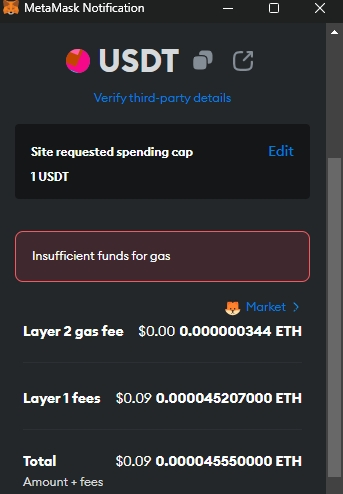

# [去中心化交易所](/2023/11/decentralized_exchange.md)

去中心化交易所没有KYC(Konw Your Customer)所以没有注册账号的概念，登录账号变成 connect wallet

看了下 uniswap/uniswap 都支持 metamask/imtoken 等主流eth钱包，考虑到imtoken只有手机端要扫码很不方便，我选择用metamask浏览器插件，metamask钱包账号由密码+助记词 组成

## ETH stake and validator
进入metamask/imtoken的界面有两个按钮界面叫 swap和stake 我不太熟悉需要了解下

```
ETH staking 指的是持有并锁定一定数量ETH作为一种参与以太坊网络保障机制的方式(质押给去中心化交易所池子才叫流动性挖矿)，
在eth2.0和它的权益证明共识算法中(Proof of Shake)，
用户可以通过将自己的 ETH 在特定的智能合约中锁定来成为 **validator** 参与验证新交易和创建新区块的过程并获得奖励
最低锁定量是32ETH(约7万美金)，没有足够资金的用户可以参与 staking pool 公共质押池
如果用户a提供了验证者节点算力用户b提供了32个ETH质押到节点上，实际上完成交易/创建新区看只有用户b获得奖励，跟区块链1.0时代算力奖励
EIP-1559引入的基本费用销毁机制意味着每当用户进行交易时，一个固定的基本费用会被销毁（燃烧）。这个基本费用的大小根据网络拥堵程度动态调整。在很多情况下，销毁的ETH数量可以部分或完全抵消新铸造的ETH
```

### non-custodial stake
所谓非托管质押就不像传统交易所一样知道你钱包私钥，用户使用自己的私钥签署交易，授权智能合约按照既定规则使用其ETH进行质押。这种方式确保了只有用户才能对其资产下达命令
通过智能合约地址调用智能合约函数，用私钥对交易所数据签名，智能合约不会知道你私钥

## eth swap 去中心化交易
layer1 就是有一个 swap 池子，自动按一定价格从池子换。缺点是受网络拥堵影响手续费不确定且成交价格会有 **滑点(slippage)** 例如你下单买入时看到 eth 价格是2000结果最终成交价是2011这样11u的滑点导致你多花11u才买到一个eth带来亏损

### oracle price
DEX 去中心化交易所相关概念，由于预言机提供的数据来源于区块链外部，因此存在信任问题，引入了中心化的风险因素

## 跨链转账
我从okx提币到metamask的时候，发现erc20要4u不止的手续费，Optimistic网络较为便宜0.1u手续费

不过metamask这样的eth钱包地址也是很方便啊，所有token不同币种不同网络/链都是用同一个metamask的eth地址收钱即可


```
在区块链领域，"跨链转账"指的是将资产从一条链传输到另一条链。这通常需要一个特殊的协议或桥梁来实现不同区块链之间的通信和资产转移。以您提到的从 Optimistic Ethereum (Optimism) 转账到 Ethereum 主网的 USDT 为例，通常有以下步骤：

准备钱包与资金：确保你的MetaMask钱包已经连接到Optimism网络，并且有足够的USDT和ETH（或其他Optimism网络的本地代币）来支付转账费用。

查找跨链桥接服务：为了实现Optimism和Ethereum主网间的USDT转移，你需要找到一个支持这两个网络的跨链桥。常见的跨链桥包括：Synapse Bridge

访问桥梁服务的网站，并按照指示进行操作。确保该桥梁服务支持你要转移的资产类型。

通过跨链桥转账：在桥梁服务的界面中选择：

你想从哪个网络转出（源网络，例如Optimism）
你想转到哪个网络（目标网络，例如Ethereum主网）
转账的资产种类和数量（例如USDT）
然后，你需要确认交易并支付相应的费用。这些费用可能包括转账费用、桥梁服务费和网络手续费。根据不同桥梁服务的具体实现，跨链转账可能需要一些时间来完成确认。

确认交易：在MetaMask钱包或相应的区块链浏览器中跟踪交易状态。当交易完成后，你的USDT将从Optimism网络转移到Ethereum主网。

在目标网络接收资产：转账完成后，你的MetaMask钱包中应该会显示已经收到来自Ethereum主网的USDT，前提是你的MetaMask钱包已连接到Ethereum主网。

请记住，跨链转账通常涉及更高的风险和费用，因为它不仅需要网络手续费，还可能需要支付桥梁服务的费用。在进行跨链转账之前，一定要确保你使用的桥梁服务是安全和可靠的
```

除了 gpt 说的跨链桥的技术可以花点钱跨链转账，于是我想到okx这样传统交易所其实也可以当作跨链桥用，metamask上面Optimism网络提币到okx，然后再从okx提币回到erc20网络

## ERC20 手续费过高



我仅仅是从 metamask 提币一个u到dydx结果要收那么多eth手续费我钱包也没有eth只好作罢

```
Ethereum 主网（经常被提到的“ERC20 网络”）因其智能合约功能和去中心化应用（DApp）的生态系统而受到欢迎。这也意味着它的网络可能会非常拥堵，导致交易费用（也就是Gas费）上升。当网络拥堵时，用户必须支付更高的Gas费以确保他们的交易被矿工优先处理。

相比之下，支付宝这样的中心化金融服务由单一实体运营，并且不需要支付矿工费用，其系统设计允许它以低成本处理交易。此外，为了吸引和保持用户，支付平台可能会补贴交易费用，或者因为大规模操作引起的成本效益而不向终端用户收取费用。

对于Ethereum网络的高手续费问题，社区正在通过多种方法来解决：

Layer 2解决方案：如Optimism, Arbitrum, zkSync等，Layer 2平台通过在Ethereum主网之上运行，提供了更快速且成本更低的交易处理方式。

侧链：如Polygon（Matic），提供了与Ethereum主网分离的区块链网络，可以实现更低的交易费用。

Ethereum 2.0升级：Ethereum网络正在逐步升级到Ethereum 2.0，这将包括转移到权益证明（PoS）共识机制，大幅提高网络吞吐量，减少交易费用。

费用市场改革（EIP-1559）：EIP-1559是Ethereum网络的一个重要升级，它更改了交易费用市场的机制，虽然不一定减少总体费用，但可提供更可预测的交易费用模型。
```

## dydx 获取 api 密钥
按照 api v3 的文档流程走很麻烦，要注册一个 starknet 钱包，然后 metamask/starknet/dydx 互相关联钱包，最后 starknet 要生成一个私钥

```python
from dydx3 import Client
from web3 import Web3
client = Client(
    host='https://api.stage.dydx.exchange',
    web3=Web3.HTTPProvider(WEB3_PROVIDER_URL),
    stark_private_key='077c...', # 记得去掉 0x 前缀
)
onboarding_information = client.onboarding.create_user
```

后来我看网友说直接去看网页端 localStorage 的 API_KEY_PAIRS 字段 key/secret/passphrase 就全有了
