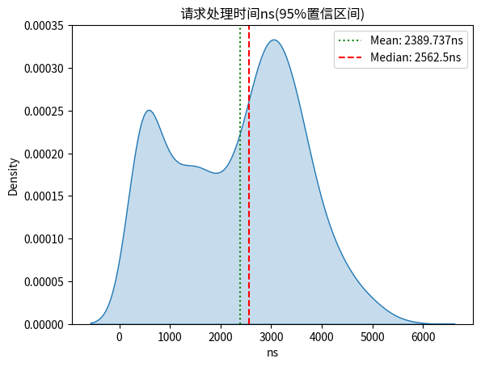
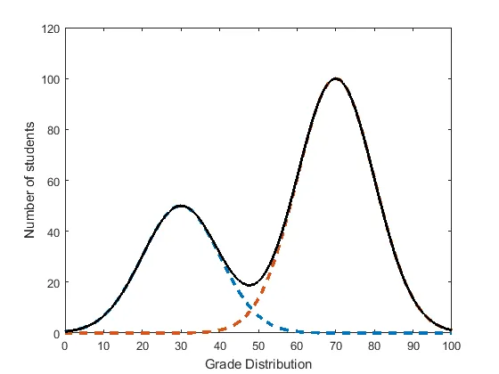
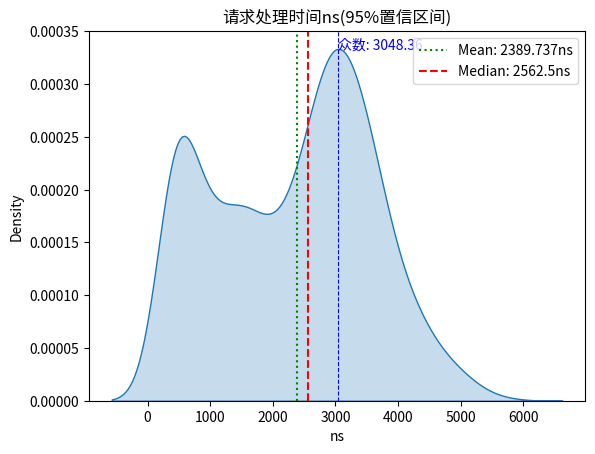

# [双峰分布biomodal](/2023/12/bimodal_distribution.md)

当我统计1000次请求处理时间的时候，kde图总会因为几个或者十几个中位数3-4倍的值导致横轴被拉升的很长显得图很不饱满右边全是空洞

于是 gpt4 说可以用 iqr 或者 95 置信区间过滤掉边缘的异常数值

```python
std = data.std()
# 确定95%置信区间(如果数据服从正态分布)
lower_bound = mean - 2 * std
upper_bound = mean + 2 * std
# 或者
Q1 = data.quantile(0.25)
Q3 = data.quantile(0.75)
IQR = Q3 - Q1
lower_bound = Q1 - 1.5 * IQR
upper_bound = Q3 + 1.5 * IQR

# 过滤异常值，保留位于边界内的数据
filtered_data = data[(data >= lower_bound) & (data <= upper_bound)]
```

以下是画图的代码

```python
print(f"过滤掉数据 {data.count() - filtered_data.count()}")
sns.kdeplot(filtered_data, fill=True)

plt.title(f'请求处理时间ns(95%置信区间)')
plt.xlabel('ns')

plt.axvline(mean, color='g', linestyle='dotted', label=f'Mean: {mean}ns')
plt.axvline(median, color='r', linestyle='dashed', label=f'Median: {median}ns')
plt.legend()
# or use plt.clf() clear graph cache after plot
plt.show()
```

过滤掉异常值之后我的图画的挺好看的，有一高一低两个波峰gpt说这是 **双峰分布**，wiki属于
[Multimodal分布的一种](https://en.wikipedia.org/wiki/Multimodal_distribution)



双峰分布有点像两个正态分布的波峰叠加之后的波形



## 众数mode

我突然想到，波峰就是出现频率最高的数，也就是**众数(mode)**

```python
kde = gaussian_kde(filtered_data)
x_eval = np.linspace(min(filtered_data), max(filtered_data), num=filtered_data.count())
kde_values = kde(x_eval)
# 找到 kde_values 中的最大值对应的 x_eval 的值
mode_estimate = x_eval[np.argmax(kde_values)]
# 在图上用竖线标出估计的波峰位置
plt.axvline(mode_estimate, color='b', linestyle='dashed', linewidth=0.8)
# 添加一个文本框来显示波峰的估计值
plt.text(mode_estimate, plt.ylim()[1]*0.95, f'众数: {mode_estimate:.2f}', color='b', ha='left')
```


