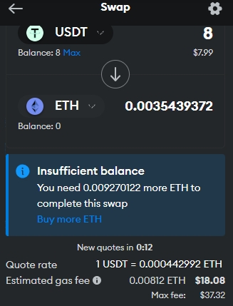
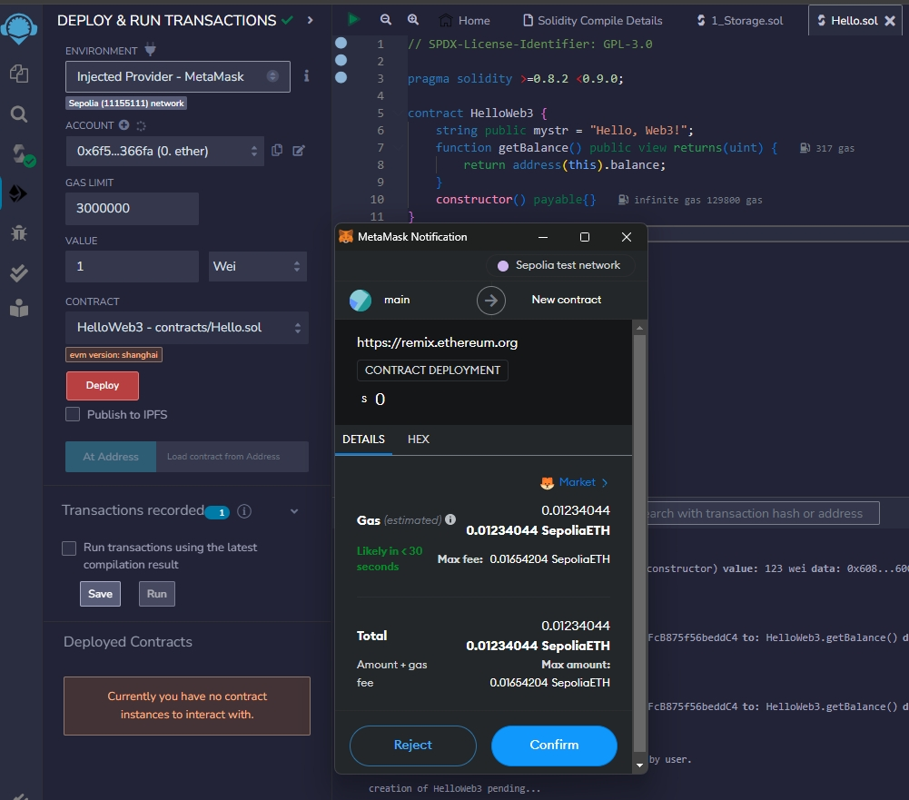

# [智能合约部署踩坑](/2023/12/smart_contract.md)

## eth 钱包入金踩坑

智能合约一旦运行就要消耗计算资源，消耗计算资源要按量支付gas

于是得搞一个类似 goerli 这样的eth测试网然后通过水龙头(faucet)网站空投一些测试币eth

当我注册好alchemy账号然后去最大的水龙头网站(每日可领取0.2eth) goerlifaucet.com 的时候

> To receive Goerli ETH, your wallet must have a minimum balance of 0.001 ETH on mainnet

没办法只从交易所提币过去，发现最小转账金额是0.01eth加上手续费就超过30刀成本了

然后我尝试从ok上提币10刀到metamask，结果swap成eth最小金额也要0.01eth+手续费，而且swap手续费巨贵

goerli水龙头网站要么就要eth有余额防机器人，要么就说我ip是代理不能用

考虑到 dydx 这个月也从 goerli 换成 sepolia 测试网，于是我找了个野鸡web3网站「注册就送测试网eth」

<https://sepolia.etherscan.io/tx/0x7a67edb51103cbb26a4b464f23c82a1af5468bbd8669e7b391520d2319441d69

gas 费用 77.5 Gwei 看来果然测试网用的人太少，所以计算资源/网络都不繁忙这么低手续费

eth 为了避免浮点数 wei 是最低数量单位 10**-18 个 eth 然后 Gwei 是 10**-9个

## deploy 界面的 value 输入框是什么

如果是转账功能的智能合约，value就是转账的金额单位是wei，value输入框指的是 **部署合约或执行合约函数时发送的以太币数量**

所以对于一个查询余额的函数来说，默认下发送0wei执行结果就是0，发送多少wei执行结果就是返回多少wei

## gas limit 输入框

设定本次执行最大消耗的wei，避免恶意合约死循环耗尽用户余额，如果执行时超过gas limit就会回滚，但是依然会扣除gas

gas limit 机制应该是一次性发送3百万个，如果没用完就退还剩余 gas

实际的 gas 费用则是 = gas消耗数量 * 动态gas价格

网络拥堵/计算资源集群负载高的时候，gas价格就高，当合约执行排队中的时候会按交易者的gas价格报价竞价排名，当然交易所和钱包软件也会给出当前动态gas报价

智能合约听上去就跟 Function as a Service 这样的按量计算有请求就冷启动服务的很像

但是智能合约一旦花钱部署在区块链上就永久存在不可篡改，而aws的FaaS一旦你不给钱立马删你代码

### gas 的利益链分析

合约开发者不会从gas直接获利，这样避免了让开发者写出性能很慢的代码恶意消耗gas，也鼓励开发者提高合约代码性能来降低gas费用让更多人低门槛使用形成良性循环

开发者获利的渠道就是合约设定一个交易费用或者手续费，例如metamask的swap就是交易费和手续费收两次钱 或者通过发币/代币经济生态等办法盈利

---

参考 <https://juejin.cn/post/7193227512154390589>
