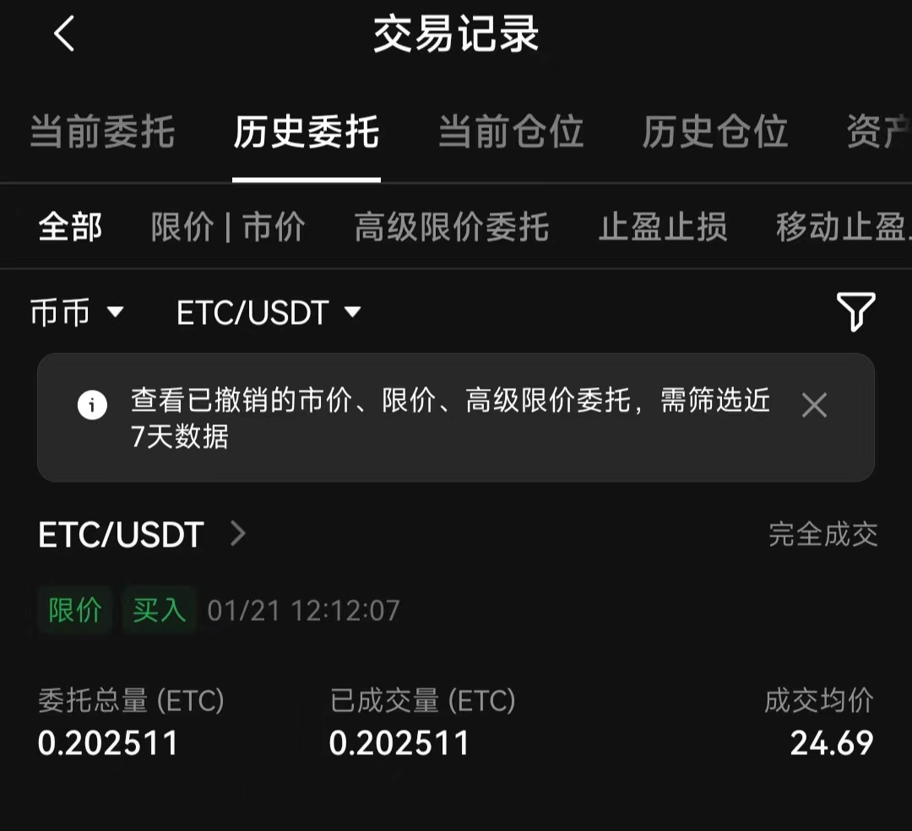
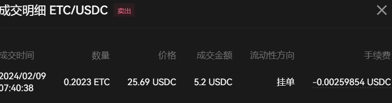

# [ETC投资复盘](/2024/02/etc_investmen_review.md)

在 gateio live 直播中，24/01/21 听到某人建议买点 etc 于是我买了大约 5 刀价值

但是买的 OP/ADA/ETC 可能是流动性太差我放在ok简单赚币一直是匹配中，就连新的JUP币都能成功借出去赚利息

2/8 晚上大盘指数btc上涨到 4.5 万，大盘指数涨意味着大部分币也会跟着涨

基于咨询基本面分析，于是我料定etc应该算高价了，可以出掉

一开始我想这usdc手续费更低手续费有万3优惠，而且ok有usdc新年活动额外5%年化

但是很快我发现了etc-usdc的不对劲，流动性太差每一小时才1-2个成交买卖之间spread太大而且orderbook价格不均匀，而etc-usdt的流动性好太多了一小时几十笔

而且usdc流动性差到，明显看到有个量化策略机器人一直用比卖1低一个tick的价格挂单，然后过一会没有成交就撤单

于是我反复修改订单降低1个tick价格，当我降低到是买一价格+0.01的时候瞬间有个量化机器人吃掉我的单

回头想想usdc手续费优惠也就万3，但是usdt计价流动性更好，哪怕多卖0.01一个tick的价格完全可能而且售价多0.01的利润远远大于万3

看来usdc还是只适合btc/eth/sol主流币的计价和买入，etc这样的小币种算了

明明etc是eth硬分叉出来的，代码也是几乎一模一样，除了证券用途还有消耗etc支付智能合约gas的使用价值，怎么价格连eth的百分之一都不到

---

OP现货复盘，手续费均为maker万8

24/01/21 买入开仓 价格3.21 数量1.5 btc价格41733
24/02/11 卖出平仓 价格3.60 数量1.5 btc价格48200 btc涨幅15.4% op涨幅10.8%

LTC 71.36买 71.37卖(卖飞了最高72.7) 仓位价值10-20$ 左右 简单赚币一直没吃到放贷利息，一来一回血亏千一手续费
JUP 仓位价值5$ 新股上市追涨了0.6买之后一直跌到0.4小吃点利息，但最近一周没利息了，btc涨到56000的时候总算回到0.5(卖早了能卖0.51)
这两个就是典型的横盘币不要买占用资金还亏钱，btc涨这两也不怎么涨

---

> 真是感叹啊，20年的时候我还能用600u抄底0.1个btc，现在所有u加起来都买不了0.1 btc(币安不少场外交易卖方要求0.1btc持仓才能交易), btc价格到了57000
