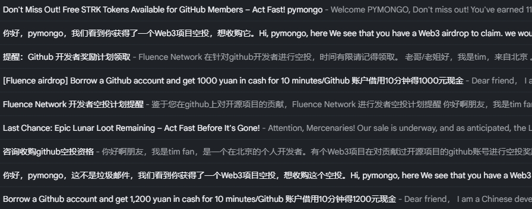
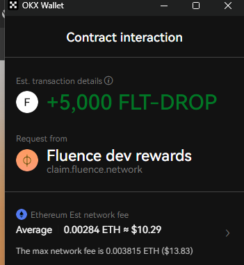
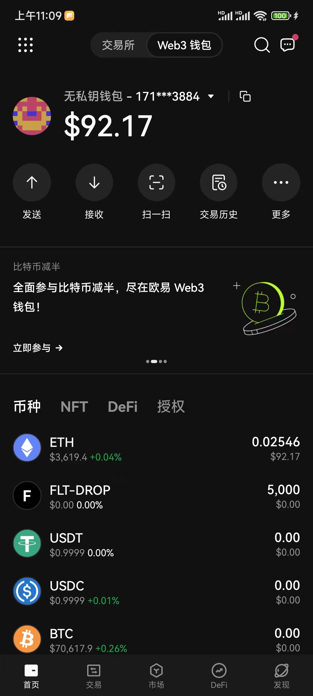

# [FLT 空投撸毛](/2024/03/fluence_airdrop.md)

很早之前gal和ens有给github用户大面积空投，24年的STRK空投数量很少我没有资格(后面发现其实有) 最近收到很多spam的邮件让我领取fluence空投于是我正常趁这个机会学习下撸毛(区块链薅羊毛)

关键词: Eligibility(资格)



```
我们希望花费手续费在内的共约 600 USD（约 4200 CNY）购买你的代币。如果你不会或不想申领这次空投,我们可代你操作并支付上述承诺的费用
该项目是对 Web3 开源项目曾有贡献的开发者的空投计划,本次共有 110,000 名开发者获得资格,但只对前 10,000 名申领的开发者进行代币发放
在申领之后有两个月的锁定期不能交易,申领手续费约 50 USD

90%邮件都是国人发的，例如以下模板
您好我是一个北京的web3开发者我希望...
```

我查询下这个eth合约地址空投资格有没有被发放完

- <https://etherscan.io/token/0x6081d7f04a8c31e929f25152d4ad37c83638c62b>
- <https://www.okx.com/cn/explorer/eth/token/0x6081d7f04a8c31e929f25152d4ad37c83638c62b>

HOLDERS 4148, TOTAL TRANSFERS 4149 发放人数还不到1万，说明我还有领取机会

考虑到 claim_tokens/mint 都要 eth 作为 gas 费用，于是我 connect okx wallet 提币了 0.03eth 本来这些钱是打算存 okx SushiSwap 可惜质押奖励的是 sushi 代币我并不感兴趣价值也低

为了安全性我重新新建了个github私钥结果去领空投出以下报错，原来是要用项目方snapshot快照前的github私钥，我不得已只好用自己笔记本的ssh私钥

> Specified SSH key is not eligible for claiming. Only RSA and Ed25519 keys added before our Github snapshot are supported for proof generation.



<https://www.okx.com/cn/explorer/eth/tx/0x0bf319d377bc8b6186125bd86d91b3308517f1505eadc3e3c1ab41fdea2581a4>

领取完成后 ok钱包 交易记录显示有个 合约交互 类型的交易 +5000 FLT-DROP

FLT 市价 1u, FLT-DROP 是锁仓版本的 FLT 不可交易两个月等项目方给个合约解锁成 FLT

## ok 无私钥钱包

如何删除已创建的钱包账户？基于区块链的特性，我们是没有办法对已创建的账户进行删除的，但可以在钱包内对其进行移除 metamask也是一个钱包新创建的账号不能删除

创建一个新的以太坊地址并不需要消耗Gas费用。以太坊地址是由私钥通过一系列的加密算法生成的，这个过程是在你的本地设备上完成的，不需要与以太坊网络进行交互，因此不需要消耗Gas。

然而，当你使用一个新的以太坊地址进行交易时，例如发送ETH或与智能合约交互，这些操作会在以太坊网络上产生交易，这些交易是需要消耗Gas的。

## 合约 balanceOf 函数

然后钱包币种资产列表不会显示FLT-DROP，需要在币种-自定义合约添加FLT-DROP的合约地址就能显示FLT余额了

> 为什么在我的eth钱包中有些币种资产不显示？要让我添加该币种相应的合约地址后才能显示出余额？这是因为添加合约地址之后钱包软件会调用这个币种的合约地址的余额查询function吗？可是调用一个合约的function不是会消耗gas对钱包软件的开发商要支付账单吗



当你添加代币合约地址到你的钱包时，钱包会使用该地址调用balanceOf函数来查询你的代币余额。这个函数是ERC20代币标准的一部分，所有的ERC20代币都必须实现这个函数。这个函数接受一个地址作为参数，返回该地址在该代币合约下的余额。

值得注意的是，查询余额（或者说，调用view或pure类型的函数）不会消耗gas。这些函数只读取区块链的状态，但不修改它，所以它们可以在本地运行，不需要创建交易或消耗gas。这就是为什么钱包可以频繁地查询你的代币余额，而不会产生费用。

## ETH provider

provider 是指提供以太坊网络接口的实体，它可以是本地运行的以太坊节点，也可以是像 Infura 这样的托管服务。provider 提供了一个方式，让你的应用程序可以通过 JSON-RPC 或者 WebSocket 进行与以太坊网络的交互。

质押 32 个 ETH 并运行一个验证器节点是在以太坊 2.0（也称为 Serenity 或者 Eth2）中参与权益证明（Proof of Stake，PoS）共识机制的要求。这是为了保障网络的安全性，防止恶意行为。然而，如果你只是想查询你的 ERC20 代币余额，你并不需要运行一个完整的以太坊节点，更不用说成为一个验证器节点。

你只需要一个可以访问以太坊网络的 provider，这可以是你自己运行的以太坊节点，也可以是像 Infura 这样的托管服务

ethereum-node docker 镜像部署需要5T硬盘和几百G内存性能要求极高不建议自行部署运行eth主网完整节点

## eth web3py 查询余额

```python
from web3 import Web3
import json

token_address_raw = "0x6081d7f04a8c31e929f25152d4ad37c83638c62b"
token_address = Web3.to_checksum_address(token_address_raw)
account_address_raw = "0xf6477e4ceb4c238e03ef08eb6cf0bab14a5cf65e"
account_address = Web3.to_checksum_address(account_address_raw)

token_abi = [
    {
        "constant": True,
        "name": "decimals",
        "type": "function",
        "inputs": [],
        "outputs": [{"name": "", "type": "uint8"}],
    },
    {
        "constant": True,
        "name": "balanceOf",
        "type": "function",
        "inputs": [{"name": "_owner", "type": "address"}],
        "outputs": [{"name": "balance", "type": "uint256"}],
    },
]
token_abi = json.dumps(token_abi)

# w3 = Web3(Web3.HTTPProvider('https://eth.public-rpc.com'))
# w3 = Web3(Web3.HTTPProvider('https://cloudflare-eth.com/'))
w3 = Web3(
    Web3.HTTPProvider("https://mainnet.infura.io/v3/YOUR_INFURA_TOKEN")
)

token_contract = w3.eth.contract(address=token_address, abi=token_abi)

# Get decimals
decimals = token_contract.functions.decimals().call()

# Get balance in smallest unit
balance_smallest_unit = token_contract.functions.balanceOf(account_address).call()

# Convert to actual token balance
balance = balance_smallest_unit / (10**decimals)

print(f"The balance of account {account_address_raw} is {balance}.")
```
