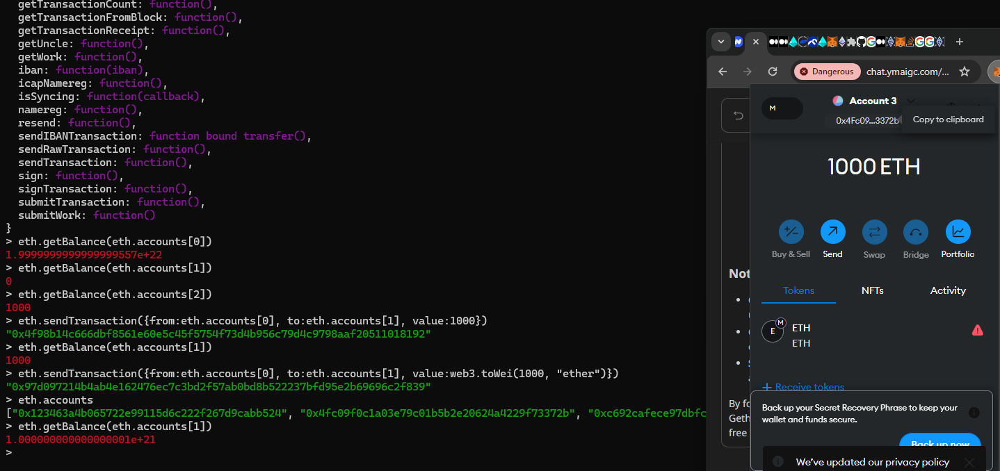
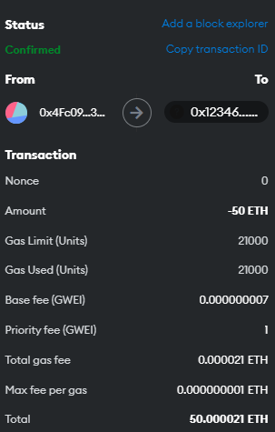

# [eth节点部署](/2024/06/deploy_eth.md)

## 创世区块

大致要部署两个模块(server) 一个是execution layer/client例如geth,reth 另一个是consensus layer/client例如prysm(go),lighthouse(rust)

```
sudo add-apt-repository -y ppa:ethereum/ethereum
sudo apt-get install `ethereum`
# installed: abigen bootnode clef ethereum evm geth rlpdump
```

eth网络的部署需要很多个进程很多的配置，好多报错我没部署起来，gpt4老用pow的配置文件教我部署eth导致报错 ` only PoS networks are supported, please transition old ones with Geth v1.13.x` 

算了还是用 docker 部署吧

> error getting credentials - err: exec: "docker-credential-desktop.exe": executable file not found in $PATH

应该是之前docker desktop版本卸载后残留的问题 删掉 `~/.docker/config.json` 的 `"credsStore": "desktop.exe"`

```
root@tokyo:~/eth-pos-devnet# docker-compose up
WARN[0000] /root/eth-pos-devnet/docker-compose.yml: `version` is obsolete
[+] Running 6/6
 ✔ Container eth-pos-devnet-geth-remove-db-1
 ✔ Container eth-pos-devnet-create-beacon-chain-genesis-1
 ✔ Container eth-pos-devnet-beacon-chain-1  
 ✔ Container eth-pos-devnet-geth-genesis-1  
 ✔ Container eth-pos-devnet-geth-1          
 ✔ Container eth-pos-devnet-validator-1     
Attaching to beacon-chain-1, create-beacon-chain-genesis-1, geth-1, geth-genesis-1, geth-remove-db-1, validator-1
create-beacon-chain-genesis-1  | time="2024-06-19T04:05:24Z" level=info msg="Specified a chain config file: /consensus/config.yml" prefix=genesis
create-beacon-chain-genesis-1  | time="2024-06-19T04:05:24Z" level=fatal msg="Could not generate beacon(灯塔) chain genesis state" error="could not set config params: version 0x05000000 for fork electra in config interop conflicts with existing config named=mainnet: configset cannot add config with conflicting fork version schedule" prefix=genesis
create-beacon-chain-genesis-1 exited with code 1
geth-remove-db-1 exited with code 0
```

https://github.com/OffchainLabs/eth-pos-devnet/issues/49

```
root@tokyo:~/eth-pos-devnet# git diff consensus/
diff --git a/consensus/config.yml b/consensus/config.yml
index 372cd8f..3057ad1 100644
--- a/consensus/config.yml
+++ b/consensus/config.yml
@@ -20,6 +20,8 @@ MAX_WITHDRAWALS_PER_PAYLOAD: 16

 DENEB_FORK_VERSION: 0x20000093


+ELECTRA_FORK_VERSION: 0x20000094
```

主要是镜像用latest的锅，换成这个锁版本的 `https://github.com/ivy-net/eth-pos-devnet/tree/wn/lock-down-images` 就好了

所以minimal单节点的eth网络至少需要三个进程:
- geth
- beacon-chain
- validator

- execution_client: Validates transactions and blocks
- sonsensus_client: Determines which blocks are part of the chain

## geth console

```
docker exec -it eth-pos-devnet-geth-1 /bin/sh
geth attach http://localhost:8545
```

### 列出所有钱包和最新一个区块有多少交易

```
> eth.blockNumber
1145
> eth.getBlock(1145)
{
  baseFeePerGas: 7,
  difficulty: 0,
  extraData: "0xd883010e06846765746888676f312e32322e34856c696e7578",
  gasLimit: 30000000,
  gasUsed: 0,
  hash: "0x371b783a6274552c0a7aef2bc9e4c3a97caac02128091de5277ab706638802a2",
  ...
}
> eth.accounts
["0x123463a4b065722e99115d6c222f267d9cabb524"]
> eth.getBalance(eth.accounts[0])
2e+22
> personal.unlockAccount(eth.accounts[0])
Unlock account 0x123463a4b065722e99115d6c222f267d9cabb524
Passphrase:
#初始地址不知道密码重新创建两个钱包算了
> personal.newAccount()
Passphrase:
Repeat passphrase:
"0x4Fc09F0c1a03E79c01B5b2E20624a4229f73372b"
> personal.newAccount()
Passphrase:
Repeat passphrase:
"0xC692CafEce97dBfcB7D41dBa05aF3f77AF61d543"
> eth.accounts
["0x123463a4b065722e99115d6c222f267d9cabb524", "0x4fc09f0c1a03e79c01b5b2e20624a4229f73372b", "0xc692cafece97dbfcb7d41dba05af3f77af61d543"]
> a1="0x4Fc09F0c1a03E79c01B5b2E20624a4229f73372b"
"0x4Fc09F0c1a03E79c01B5b2E20624a4229f73372b"
> a2="0xC692CafEce97dBfcB7D41dBa05aF3f77AF61d543"
"0xC692CafEce97dBfcB7D41dBa05aF3f77AF61d543"
> eth.sendTransaction({from:a1, to:a2, value:1000})
Error: insufficient funds for transfer
        at web3.js:6387:9(39)
        at send (web3.js:5116:62(29))
        at <eval>:1:20(9)
```

### admin api

docker inspect 7e6229b8a41c | grep md -A18

原来 eth-pos-devnet repo 默认没有开权限 于是我改了下 docker compose yml 就好了

```
> admin.nodeInfo
{
  enode: "enode://4e62f4038eb7c1292af7c1b608a201210afb81f11b1a7d1cc07d51120a7400930c75ac10be146bd4c77da2b2faa7a0c65feecac43565938096550841a95e92ce@127.0.0.1:30303?discport=0",
  enr: "enr:-Jy4QB-...",
  id: "a5f3e3921729be2b81a7696bc3c1bf338c5be9acd4a0a7426019ecd0011ca7cd",
  ip: "127.0.0.1",
  listenAddr: "[::]:30303",
  name: "Geth/v1.14.3-stable-ab48ba42/linux-amd64/go1.22.3",
  ...
}
> admin.peers
```

### metamask连local network

metamask 添加自定义网络只需要chainId和一个 rpc url 也就是 http://localhost:8545 我把wsl的docker端口用vscode remote port forward映射出来 通过 eth.chainId(用于区分不同的以太坊网络例如主网/测试网) 获取到16进制的链id转换成32382十进制

由于创世区块中验证者节点绑定的钱包密码我不知道是多少，不知道密码也能调用交易api转账，但添加进metamask是需要密码的所以得重新创建几个钱包

- The network launches with a Validator Deposit Contract deployed at address 0x4242424242424242424242424242424242424242. This can be used to onboard new validators into the network by depositing 32 ETH into the contract
- The default account used in the go-ethereum node is address 0x123463a4b065722e99115d6c222f267d9cabb524 which comes seeded with ETH for use in the network. This can be used to send transactions, deploy contracts, and more
- The default account, 0x123463a4b065722e99115d6c222f267d9cabb524 is also set as the fee recipient for transaction fees proposed validators in Prysm. This address will be receiving the fees of all proposer activity

```
> eth.chainId()
"0x7e7e"
```

#### 1ether=10**9Gwei=10**18wei

execution/genesis.json

```
	"alloc": {
		"123463a4b065722e99115d6c222f267d9cabb524": {
			"balance": "0x43c33c1937564800000"
		},
  }

>>> 0x43c33c1937564800000 * 10 ** -18  
20000.0
```

验证者节点的钱包有两万个eth，所有交易的gas费都收到这个钱包里面

#### 创建钱包并转账

```
> personal.newAccount()
Passphrase:
Repeat passphrase:
"0x4Fc09F0c1a03E79c01B5b2E20624a4229f73372b"
> eth.sendTransaction({from:eth.accounts[0], to:eth.accounts[1], value:web3.toWei(1000, "ether")})
"0x97d097214b4ab4e162476ec7c3bd2f57ab0bd8b522237bfd95e2b69696c2f839"
> eth.getTransaction(_)
```

于是创建出钱包密钥json文件 eth-pos-devnet/execution/keystore/UTC--2024-06-19T15-42-56.835783384Z--4fc09f0c1a03e79c01b5b2e20624a4229f73372b

> {"address":"4fc09f0c1a03e79c01b5b2e20624a4229f73372b","crypto":{"cipher":"aes-128-ctr","ciphertext":"6f2aa8eea55e6549d2ff32d65fe52e3d139aacbb7d13a382958ec1bb54ac39b6","cipherparams":{"iv":"6c9b1240c5eea46e9fed00454f212ae4"},"kdf":"scrypt","kdfparams":{"dklen":32,"n":262144,"p":1,"r":8,"salt":"b2b07aaec4e4a2d732ffbc747e75c7350cb995446ff27366209b51bc8e56935e"},"mac":"3c7f72a0e455f7daff048732dc928069cc1cd667748837d704a393729c5b3984"},"id":"b7081a79-773e-4c88-94cc-050cf73840ce","version":3}

上传json文件和passphrase就能将钱包导入到metamask的local network中了



## eth tx数据格式



```
> eth.getTransaction('0xbbe98d6c2dd7340238768203cc5ffc4dcceaa2d46ff297e1887f718aa4f2649a')
{
  # 用于 EIP-2930 中的交易类型，指定交易中访问的地址和存储键，以减少 Gas 消耗
  accessList: [],
  blockHash: "0x5d73c1ff6faa50b0f2ec31ee2fc84dfe6b3b9cde97347b54a011c503ae74ef77",
  blockNumber: 1332,
  chainId: "0x7e7e",
  from: "0x4fc09f0c1a03e79c01b5b2e20624a4229f73372b",
  # 交易中指定的最大 Gas 限额
  gas: 21000,
  # 每单位 Gas 的价格 1gwei
  gasPrice: 1000000007,
  hash: "0xbbe98d6c2dd7340238768203cc5ffc4dcceaa2d46ff297e1887f718aa4f2649a",
  # 智能合约调用的入参 0x 表示没有入参
  input: "0x",
  # 交易中指定的每单位 Gas 的最大费用（单位为 Wei），用于 EIP-1559 交易
  maxFeePerGas: 1000000007,
  # 交易中指定的每单位 Gas 的最大优先费用（单位为 Wei），用于 EIP-1559 交易
  maxPriorityFeePerGas: 1000000007,
  # 发送方账户的交易计数器，确保交易的唯一性和顺序
  nonce: 0,
  # 交易签名的一部分
  r: "0x8a6b9631770a5136534481643de71cd9e8520819f6e0ff476f4fde6bcb8df3a7",
  # 交易签名的一部分
  s: "0x6f8a5e89569c391a5c2384fd5ea693c6c09320fc6c9bc5af1c54e911ee01d8a4",
  to: "0x123463a4b065722e99115d6c222f267d9cabb524",
  # 交易在区块中的索引，一个区块可以包含多个tx
  transactionIndex: 0,
  # 0x2 表示 EIP-1559 交易
  type: "0x2",
  # 交易签名的一部分，表示恢复 ID
  v: "0x1",
  # 转账的eth数量单位wei
  value: 50000000000000000000,
  # 用于 EIP-1559 交易的额外签名字段
  yParity: "0x1"
}
# 要调用转账收据接口才能获取实际花了多少gas
> eth.getTransactionReceipt('0xbbe98d6c2dd7340238768203cc5ffc4dcceaa2d46ff297e1887f718aa4f2649a')
{
  blockHash: "0x5d73c1ff6faa50b0f2ec31ee2fc84dfe6b3b9cde97347b54a011c503ae74ef77",
  blockNumber: 1332,
  contractAddress: null,
  cumulativeGasUsed: 21000,
  effectiveGasPrice: 1000000007,
  from: "0x4fc09f0c1a03e79c01b5b2e20624a4229f73372b",
  gasUsed: 21000,
  logs: [],
  logsBloom: "0x00000000000000000000000000000000000000000000000000000000000000000000000000000000000000000000000000000000000000000000000000000000000000000000000000000000000000000000000000000000000000000000000000000000000000000000000000000000000000000000000000000000000000000000000000000000000000000000000000000000000000000000000000000000000000000000000000000000000000000000000000000000000000000000000000000000000000000000000000000000000000000000000000000000000000000000000000000000000000000000000000000000000000000000000000000000",
  status: "0x1",
  to: "0x123463a4b065722e99115d6c222f267d9cabb524",
  transactionHash: "0xbbe98d6c2dd7340238768203cc5ffc4dcceaa2d46ff297e1887f718aa4f2649a",
  transactionIndex: 0,
  type: "0x2"
}

> eth.getBlock(1332)
{
  # 基础 Gas 费率
  baseFeePerGas: 7,
  # Represents the amount of gas used for blob transactions in the block. Blobs are a feature related to data availability in the Ethereum protocol.
  blobGasUsed: 0,
  # (deprecated)
  difficulty: 0,
  # The excess gas used for blob transactions beyond the base level
  excessBlobGas: 0,
  # 额外数据，可以包含任意信息，通常由矿工或验证者添加
  extraData: "0xd883010e03846765746888676f312e32322e33856c696e7578",
  # 当前区块的最大 Gas 限额。这个值限制了区块中可以包含的最大 Gas 数量
  gasLimit: 30000000,
  # 当前区块中已经使用的 Gas 数量
  gasUsed: 21000,
  hash: "0x5d73c1ff6faa50b0f2ec31ee2fc84dfe6b3b9cde97347b54a011c503ae74ef77",
  # 日志布隆过滤器，用于快速查找区块中的事件日志
  logsBloom: "0x00000000000000000000000000000000000000000000000000000000000000000000000000000000000000000000000000000000000000000000000000000000000000000000000000000000000000000000000000000000000000000000000000000000000000000000000000000000000000000000000000000000000000000000000000000000000000000000000000000000000000000000000000000000000000000000000000000000000000000000000000000000000000000000000000000000000000000000000000000000000000000000000000000000000000000000000000000000000000000000000000000000000000000000000000000000",
  miner: "0x123463a4b065722e99115d6c222f267d9cabb524",
  # A hash used in the mining process to prove that a sufficient amount of computation has been done.
  mixHash: "0x7b139e6541c9a8f5fd325a51da53aeb96a834600d80b9cfbe5f9e91832f2a45f",
  # (deprecated)A value used in the mining process to find a hash that meets the difficulty target
  nonce: "0x0000000000000000",
  number: 1332,
  parentBeaconBlockRoot: "0xd26b91bf37086ac925e4bffc359f6db8bc78c0ad9d9f7b0a052cf1132be4285c",
  parentHash: "0x45504d2c5e71811a8d27e5b52ff4099f6125d1c239bae1868d96bb3193f43482",
  # The root of the receipts trie of the block, which is a cryptographic commitment to all the receipts of the transactions in the block.
  receiptsRoot: "0xf78dfb743fbd92ade140711c8bbc542b5e307f0ab7984eff35d751969fe57efa",
  # The SHA3 hash of the uncles data in the block
  sha3Uncles: "0x1dcc4de8dec75d7aab85b567b6ccd41ad312451b948a7413f0a142fd40d49347",
  # The size of the block in bytes
  size: 731,
  # The root of the state trie of the block, which is a cryptographic commitment to the state of all accounts.
  stateRoot: "0x2accd9532755a6603103e5a91d30daf05468f1b2b52954d5bf1eb124b7916613",
  timestamp: 1718813646,
  totalDifficulty: 1,
  transactions: ["0xbbe98d6c2dd7340238768203cc5ffc4dcceaa2d46ff297e1887f718aa4f2649a"],
  transactionsRoot: "0x14657e3e4926c1bcb0ae3acbde958b8f0a7bd43d787895ed273af50ed95229b6",
  # An array of uncle block hashes included in this block
  # 未能成为主链一部分的有效区块。由于以太坊的区块生成速度较快，有时会出现多个矿工几乎同时挖出区块的情况。这些区块中只有一个能成为主链的一部分，其他的则成为叔块
  uncles: [],
  # An array of withdrawals included in this block
  # 验证者可以将他们的eth质押到信标链上以帮助保护网络。withdrawals 字段包含了从质押合约中提取的记录
  withdrawals: [],
  withdrawalsRoot: "0x56e81f171bcc55a6ff8345e692c0f86e5b48e01b996cadc001622fb5e363b421"
}
```

### Orphan Blocks
btc orphan blocks类似eth uncles也是因为最长链原则或数据竞争导致未能合并到主链的有效区块，区别就是eth的验证者产出uncles也会得到奖励而btc没奖励

### eth stateRoot

`stateRoot` 是以太坊区块头中的一个重要字段，但它不仅仅是所有钱包余额的哈希摘要。它实际上是整个以太坊状态的一个Merkle Patricia树的根哈希。让我们详细解释一下：

### 如何分析交易有没有调用智能合约

- to: "0x123463a4b065722e99115d6c222f267d9cabb524"：需要进一步确认这个地址是否是智能合约地址。如果这个地址是一个普通的以太坊地址，那么这可能是一个普通的ETH转账
- input: "0x"：input 字段为空，表示没有附加数据。这通常意味着这是一笔普通的ETH转账，而不是调用智能合约
- gasUsed: 21000：消耗的gas正好是 21,000，这是一个普通ETH转账的标准gas费用

列出所有智能合约地址需要遍历区块链中的所有账户地址，并检查每个地址是否包含代码

- 检查是不是合约 **eth.getCode(addr)!="0x"**
- 检查是不是钱包 eth.getBalance 或 eth.getTransactionCount(获取nonce)

### 以太坊状态（State）

以太坊状态包括以下几个方面：
1. **账户余额**：每个账户的以太币余额。
2. **账户的存储数据**：智能合约账户的存储数据。
3. **账户的代码**：智能合约账户的代码。
4. **账户的nonce**：每个账户的交易计数器，用于防止重放攻击。

#### Merkle Patricia 树

以太坊使用一种叫做Merkle Patricia树的数据结构来存储整个状态。Merkle Patricia树是一种混合数据结构，结合了Merkle树和Patricia树的特点。它具有以下优点：
- **高效的验证**：Merkle树的特性使得我们可以高效地验证某个数据是否包含在树中。
- **紧凑的存储**：Patricia树的特性使得我们可以高效地存储和检索数据。

#### stateRoot

`stateRoot` 是当前区块中整个以太坊状态的Merkle Patricia树的根哈希。它不仅仅是所有账户余额的哈希，而是整个状态的哈希。具体来说，它包含了以下内容的哈希：
- 所有账户的余额
- 所有账户的存储数据
- 所有账户的代码
- 所有账户的nonce

`stateRoot` 是当前以太坊区块中整个状态的一个Merkle Patricia树的根哈希。它不仅包含了所有账户的余额，还包括了账户的存储数据、代码和nonce。因此，它是整个以太坊状态的一个完整的哈希摘要，而不仅仅是钱包余额的哈希。

## 总结下常用的api

|api|作用|
|---|---|
|admin.nodeInfo|
|admin.peers|
|admin.dataDir|获取存放密钥等数据的路径|
|eth.chainId|metamask添加自定义网络需要|
|eth.accounts|
|web3.fromWei(amount, 'ether')|将eth.getBalance的返回值转为eth|
|web3.fromWei(amount, 'ether')|将eth.getBalance的返回值转为eth|


## eth的rust生态

- execution_client: reth(包含revm?)
- consensus_client: lighthouse
- rpc/api_sdk: https://github.com/alloy-rs/alloy
- foundry: 类似remix

另外经典的mev(solidity)实现: https://github.com/libevm/subway
