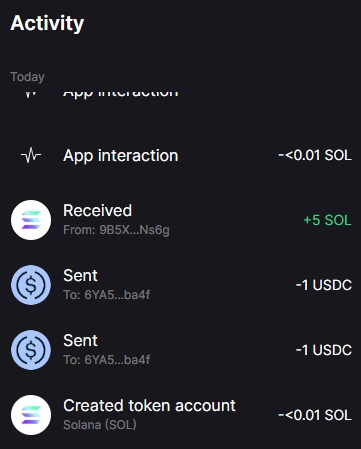

# [SOL合约部署调用](/2024/07/solana_deploy_invoke_program.md)

## 常见术语
- SPL: Solana Program Library
- PDAs: Program Derived Addresses
- CPI: Cross-Program Invocation

> BPF is a highly efficient bytecode execution environment initially developed for network packet filtering in the Linux kernel. Solana leverages BPF as the execution environment for its smart contracts

## 开发环境
参考 <https://solana.com/developers/guides/getstarted/setup-local-development>

由于 devnet 会定时删数据滚服，然后 chain_id+=1 所以用 devnet 好处是数据少 rpc 节点负担小 延迟低

> solana config set --url https://api.devnet.solana.com

然后就是 devnet 基础设施多点(explorer区块浏览器也能连localhost)，主要是我可怜的笔记本内存太小了不想运行个sol全节点

就像eth不用remix这样web的IDE，sol也不用solana playground否则像我当初remix学solidity都是一键傻瓜部署运行结果连部署和调用的底层原理一点都不懂

## 部署合约
代码参考 https://solana.com/developers/guides/getstarted/hello-world-in-your-browser

```
cargo new --lib firstsol
cd firstsol
echo -e '[toolchain]\nchannel = "1.76.0"\n' > rust-toolchain.toml
cargo add solana-program

[lib]
crate-type = ["cdylib", "lib"]
```

```
$ cargo build-bpf
$ solana program deploy target/deploy/firstsol.so
Program Id: 6jL67XKqEVWPBZEmMT8AuhTP4zJefpPs48BmV3JLxncR
$ solana program show --programs
Program Id                                   | Slot      | Authority                                    | Balance
6jL67XKqEVWPBZEmMT8AuhTP4zJefpPs48BmV3JLxncR | 312032887 | 6YA5ZxLRNuYEg44xbkLPtgbu5dBQdEftcWS31kpyba4f | 0.1350588 SOL
```

## ts/rs调用合约

代码参考 <https://github.com/pymongo/solana_client_example/blob/master/examples/invoke_program.rs>

## Borsh 序列化格式

智能合约的入参需要用 borsh 序列化格式编码

- NEAR/SOL 智能合约的入参/指令用 borsh 格式(NEAR研发的)进行序列化
- APT/SUI 智能合约用 move 的 bcs 格式序列化
- borsh/bcs都是固定长编码，跟bincode2,protobuf小整数用变长编码不一样

## 合约销毁退租金

同一个合约项目种重复deploy的话不会创建新的program_id

> solana program close

## token acount租金

USDC转账的时候，如果接收方没有开通过USDC账户，则发送方需要支付创建USDC账户的租金，如下图


