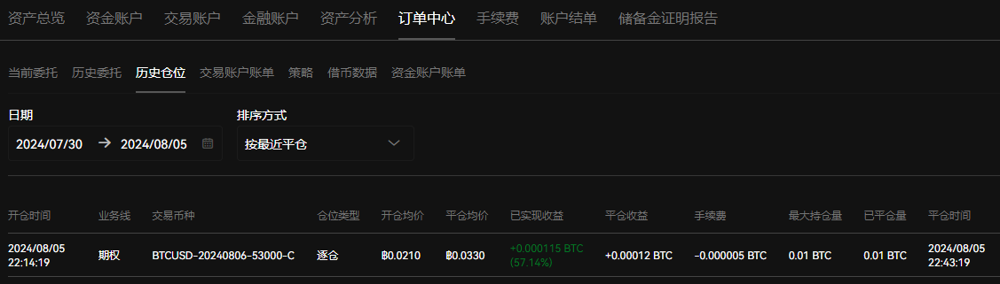

# [options](/2024/08/options.md)

大所的期权都是欧式期权，没到结算时间的时候，不准提前行权(美式可以)

## 期权手续费

||maker|taker|
|---|---|---|
|币安|均为0.03%|行权0.015%|
|ok|0.02%|0.03%|
|bybit|0.02%|0.02%|
|deribit|
|JasperVault|

## 期权产品命名

BTCUSD-20240806-53000-C

## 为什么卖PUT期权 等于做多

假设市场上就我和另一个人两个交易员，当前btc价格65000，选择了btc行权价格64000的看跌put期权产品

我和他对手盘交易我卖出所以仓位是-10

期权到期的时候，市场上就我仓位-10和对手方仓位10 没有其他市场参与者（即没有其他买入或卖出订单）

- 如果BTC跌破64000: 买方将会把BTC以行权价格64000卖给你。因此，你必须以64000的价格购买这些BTC
- 如果BTC高于64000: 赚取多头的期权费

说白了卖 put 期权的好处是，跌了就自动抄底，涨了就赚期权费

## ok期权体验

## 双币赢

- sell PUT低买: 到期(双币赢一般下午)瞬间低于设定价格就行权买入抄底，如果提前跌破设定价格就扛单浮亏套牢
- sell CALL高卖: 结算瞬间价格高于设定就被迫行权卖出，风险是会卖飞(低于市场价卖掉)

期权结算价格粒度:

>>> 0.01/1.27
0.007874015748031496
>>> 25/4591
0.0054454367240252665
>>> 500/113000
0.004424778761061947
