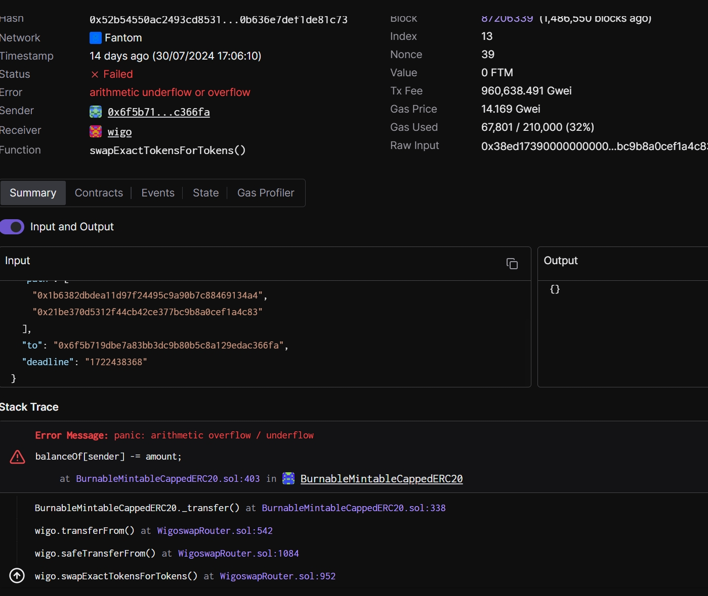

# [tenderly调试合约](/2024/08/tenderly_debug_solidity.md)

合约调用失败例如遇到require断言失败，在ethscan上面就一个 execution revert 什么报错信息都没有log也没

tenderly/Phalcon的原理是，将eth数据快照到我的tx执行前，然后在用相同的输入数据模拟合约调用，从而获得详细的报错信息

所以模拟合约调用去调试也是部署ETH全节点可以进行盈利的一种业务

