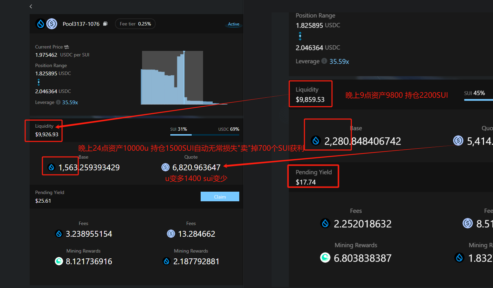
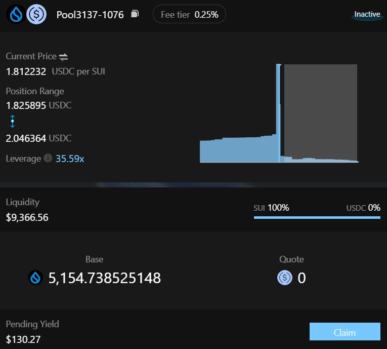
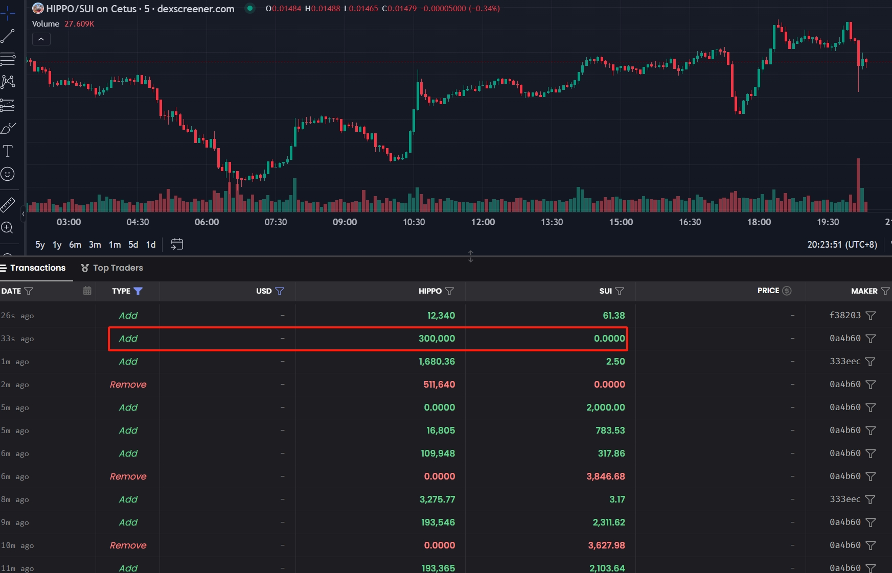

# [复盘CLMM做LP](/2024/10/clmm_lp_review.md)

之前sui bluefin交易，入了2000u 亏了200u得到1400的blue积分，bluefin赚不到钱后就存到navi去放贷

听闻circle在sui发native USDC要火，整理出五种入金路径

1. 机构申请
2. 白名单用户在sui usdc合约mint，一比一铸造，burn虫洞eth的usdc
3. swap
4. (coming soon)Cross-Chain Transfer Protocol
5. (coming soon)coinbase/binance withdraw

241009 sui价格1.96左右 赎回放贷的资金在cetus上组LP 447SUI+556USDC

LP一下午赚了3u 想添加第二个流动性报错，以为一个交易对只能加一个流动性

- AddLiquidity: 447SUI+556USDC [tx](https://suivision.xyz/txblock/2upeAiA5c5CB1DhKrDwe2s31Ea6LUdyfBVvVvbZ84sGY)
- RemLiquidity: 466SUI+520USDC [tx](https://suivision.xyz/txblock/2JtKDetFV9wyowPD8WrMWfur6Xt3Z5e8btdxpPGMLYWp)

此时由于这几天大盘不好 sui 下跌已经被 交易者卖掉sui给我 我给u给他

于是 eth 入金 2919SUI+5000USDT gas费 和 cetusSwap 成 USDC 磨损了 -1%

买3000个SUI成本价约1.91 组了个9800$的LP，sui价格区间1.86-2.05

晚上11点时sui拉盘了，LP资产涨到9900而且手续费也赚了30

但第二天下午sui跌破1.82跌出我CLMM LP区间所有u被无常损失被迫抄底成sui，满仓的sui

- AddLiquidity: 3369SUI+3323USDC (9700$) EoAuje3YsyQcUPDnDBkRHb6Vkn4SH5zPijDpP2EgD5tm
- RemLiquidity: 5164SUI (9360$) 6saFXkfkJJdzHSei6pbyj6VuxNZXBpQ11se8xzXazdSh

不甘心啊，眼看 sui hippo 下午上 kucoin 调研了下 十一期间其实已经上了 mexc 和 coinex

于是kucoin开盘15分钟前 买2000个SUI的河马 再组LP

- 买hippo的tx1 4A1HgBf4ecZ7EVe29A7DLbrpZewb1AZXeVENHAu4Yz5U
- 买hippo的tx2 EwnWhj9VqZYPkb75yvdWQNzeycNGsd1jGrHM18LLADAA

持仓成本价 0.0077SUI(0.014u) 买了 25 万个河马

kucoin下午五点河马0.014开盘涨到0.016左右

- AddLiquidity: 256533HIPPO+3110SUI (9530$) 5Qmq7VdN9h3CryCK3fD81qPWyAutgNFe1v89CZDd8sgA
- Re1Liquidity: 69548HIPPO+600SUI (9200$) sui和hippo都在跌河马跌破成本价被迫撤池子减仓避险,并卖出139SUI Bx4f1yGNkXKZg7T7Fd4iMnfSJWxkK7yV3WuCuGCcjkZH

## 能不能加单边流动性

uniswapV2 AMM 模型中不能加单边流动性 必须按照当前池子base quote等比例加流动性，只有池子第一次加流动性和交易供需关系能改变池子价格

uniswapv3 CLMM 模型中，当提供流动性的tick区间没有包含mid price即为单边流动性，如果区间低于mid price就是只加quote类似于订单簿挂maker买单，反之价格区间高于mid就是挂卖掉只放base

我也是观察到 dexscreen 上面出现很多单边加流动性才学到这个知识

我想单边流动性的好处约等于挂限价单，不需要手续费反而能赚取taker方手续费相当于负费率

如果价格区间两个tick相等前端会报错max must > min 由于cetus合约源码没有开源，不知道 open_position 函数会不会检查 min/max tick

## 一些 CLMM LP算法
- https://www.sohu.com/a/468921125_100105055
- https://docs.logarithm.fi/logarithm-finance/protocol-overview/problem-and-solution
- nhttps://medium.com/charmfinance/introducing-alpha-vaults-an-lp-strategy-for-uniswap-v3-ebf500b67796
- https://medium.com/@pintail/uniswap-a-good-deal-for-liquidity-providers-104c0b6816f2
- https://mirror.xyz/0x6a6301830d0b92e13e646f79E40E70B67C89DB24/J4OVrSiklZtoQ-GqY52tdVYDg1MpvPdzE0xYksFHsOQ
