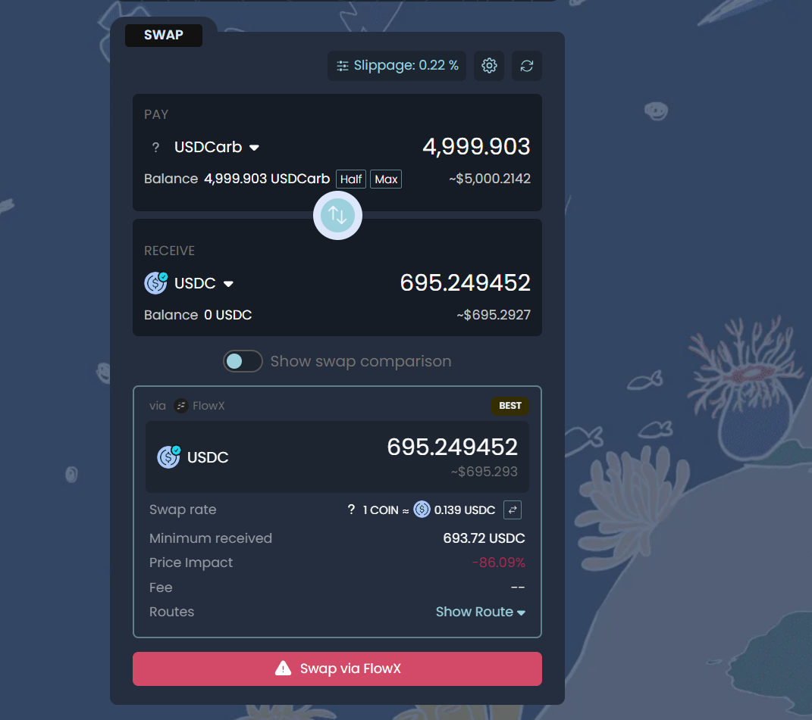

# [sui USDCarb无流动性](/2024/10/sui_usdcarb_no_liquidity.md)

想着bn买u 然后换usdc 提币到 ARB(手续费低于0.1) 再跨链到 sui 去冲土狗

心想美滋滋虫洞居然不收我协议费用，只收 src/sdt wallet 的 gas，像是 evm 知名的桥起码都有 0.1% 的协议费用用作跨链库存和资金平衡

结果虫洞从ARB bridge到sui的USDCarb不是主流的 wUSDC 而且也没有TVL和流动性

然后我在虫洞上试试 USDCarb->USDCsui 或者 USDCarb->USDC(ETH) 结果都是 no such route

只好含泪再转回 ARB 白白亏 GAS 还要等半小时: https://wormholescan.io/#/tx/Dnran7sxzvpoxCYqKVN2hVHVihzhyWx2afc4NAxt6mn2

> This transaction will take up to 24 hours to process as Wormhole has reached the daily limit for source Blockchain Sui. This is a normal and temporary security feature by the Wormhole network. Learn more about this security measure.

好吧交易所借5000u 提到ERC20手续费7 提到ARB 0.1

我选择提到ARB 走官方桥到 ETH 要等7天 走快速桥across要给12u... 还不如交易所直接提到eth链上

wormhole跨链eth->sui 协议费用1u eth侧gas费用12u...

好吧我网页关掉了 结果 虫洞转回 卡在第二步 VAA

要点那么 resume transaction 然后选 src chain sui  最后选 src tx 才能 connect metamask 在 dst 钱包继续claim/赎回资产
