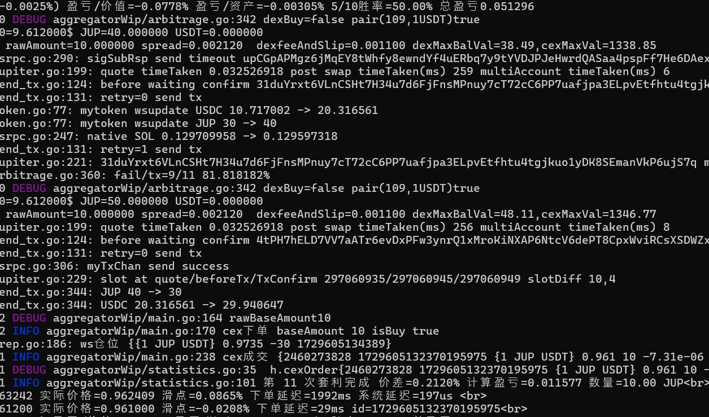

苦于 jupiter 询价 API 太慢了难以捕获市场机会，斥资购买了 号称 solana 最贵最快的 rpc 提供商 triton

笔者也订阅了 ankr/alchemy 的套餐但 rpc 请求速度依然不如付费的 helius, helius 的测试结果也不如 triton/rpcpool

毕竟一分钱一分货，50美元的还是没法跟 2000 美元的比...

triton 形成了产业生态联盟，首先跟 jupiter 深度合作，提供加速 dex 行情的 validator yellowstone 插件服务，还有跟 jupiter 合作共建的 solana.fm 区块浏览器，同步 jupiter 交易数据特别快

triton 2000 美元的套餐除了 rpc 服务还有 私享的 jupiter 快速 api 服务，以下是我的 benchmark 对比结果

||jupiter public api|triton private api|
|---|---|---|
|GET /quote|838ms|24ms|
|POST /swap|1280ms|256ms|

根据 [jupyer 文档](https://www.jupresear.ch/t/introducing-the-price-v2-api/22175)

> Price data from both buy side and sell side is cached for up to 15 seconds - it is not meaningful to spam this endpoint

无论是 price/quote/swap API 在 jupiter 的公共 API 上都会缓存一段时间，意味着询价得到的价格数据很可能是旧的行情 存在很大延迟

如果想要更低延迟拿行情，可以试试自建 jupiter api server 进行剪枝去掉些不关心的 token 降低服务器配置要求和数据带宽要求 或者购买 triton 服务

最终上套利效果图，从询价到套利交易上链的区块延迟可优化到 10 个 slot(约 4s) 以内，比起 jupiter 免费的公共 API 那可快得多

solar平时的 月会周会 twitter space, 采访 等节目录音 会不会 上传到 Spotify,Itunes或者国内的小宇宙 这样的平台？我跑步的时候比较喜欢听 podcast 可惜 itunes或者国内播客平台都搜不到 solar 的节目，还是很多人习惯用 itunes 这样的聚合 音频平台 很多高质量的内容也方便宣传社区
(主要困难是 twitter space 找往期solar的节目很不方便，还是用 itunes 这类 podcast 平台方便检索内容)
