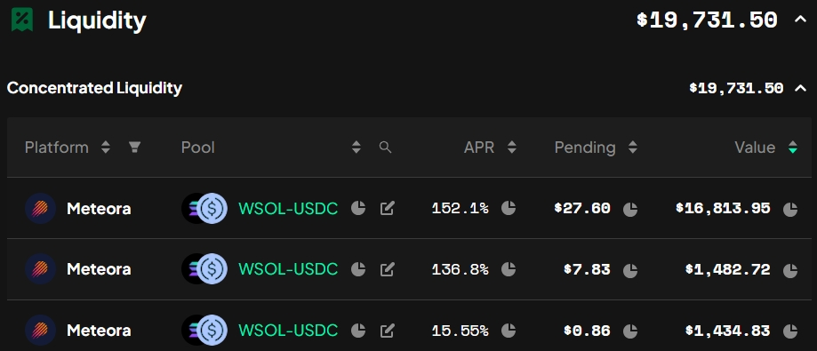

# [meteora亏钱经验](/2024/11/meteora.md)

11/25 meteora 建了个 SOL/USDT, 建仓价格249, 仓位价格范围243-263，结果第二天u全部被无常损失耗尽了... 高额的成本价抄底了SOL套牢

meteora是jup团队开发的CLMM defi平台，JUP首次IDO就在meteora首发，而且meteora跟jupiter用的是同一个triton/rpcpool的api_url(~~所以JUP亲儿子会不会在聚合器代码优先用meteora~~)

meteora好处是是做LP零协议费用(其实是有的 dynamicFee这部分里面的5%是protocol fee协议费用)，相比之下uniswapV2要1/6，raydium好像是1/5

也就是ray的LP手续费收益的一部分上交给RAY，当然有的池子会奖励RAY，RAY也会把协议费用的部分类似FTX一样回购自己股票，而cetus/dydx则是质押后获得协议费用(手续费)分红

~~(好吧据说25年发MET)还有一点就是喜欢meteora这样务实不发币专注做好产品，希望defi团队靠分润/协议费用/服务养活自己~~

## bin step
bin step应该是将合并相邻几个CLMM的tick合成一个bin, 我理解 bin step 越大, 相邻两个 CLMM tick array 之间的价差越大

Bin数量越多，报价的范围越大，流动性资金效率越低，对LP不友好资金利用率更低?

但bin step大 用户交易跨域bin/tick的可能性更小 滑点更低

## base fee
每个池子base_fee有个初始值会随着池子token数量动态调整，防止单边行情池子被快速掏空

就像GMX那样pool-based perp多空不平衡的时候优势方开仓费/资金费率会很亏，SOL/USDC快速下跌的时候 卖出SOL的base_fee会动态增加

## 三种LP模式

产品体验较好的是先选交易对再推荐三个fee/TVL最高的池子，相比之下ray按照fee/TVL排序

首先主打的 DLMM 有三种模式 spot就是资金均匀平铺在价格区间的范围内, curve模式就是资金集中在当前价格模式正态分布适用于稳定币或者LST/SOL

bid-ask模式有点像囤币策略DCA定投这样，两边厚中间薄，如果价格区间在mid-price左边就变成马丁格尔/DCA这样越跌越抄底的策略，反之挂当前价格右边就变成单边流动性卖出止盈

输入数量的地方右上有个auto-fill打开之后就是自动填充双边流动性，否则就单边流动性

## 价格区块太大(如超过5%)会切分成2个LP仓位

## 添加LP的滑点

如果池子流动性1万你添加10万 meteora会贴心的警告，你的流动性注入会带来市场波动 小心套利机器人狙击你

我理解添加LP的滑点就是，添加LP过程中有交易发生导致价格变化了，导致你最终的LP仓位产生滑点

## 什么时候撤池子避险

上涨行情还好卖飞永赚就当止盈了(当然没有钻石手拿住现货赚的多)

下跌行情的话SOL/USDC全是单边卖出的交易，因此得到的SOL手续费远大于USDC，这时候应该风控报警考虑撤走池子保住USDC避险(血的教训一直下跌LP无常损失抄底导致亏了好多USDC)

## meteora特有产品

借贷/vault存单币生息,farm/质押LP例如BONK/USDC获取BONK收益 (现在defi项目真是啥都有，例如主打永续合约的drfit都有借贷和竞猜)

vault,farm功能跟uni,panke,kamino,drift等差不多，没啥可提

meteora的vault有趣的是有点像是机枪池，就是持仓比例会往kamino,solend等平台进行单币质押

dynamic pool我理解就是自动会调整CLMM价格区间的

## SOL/USDC 仓位对比

我的仓位都是bid-ask模式 单边卖出SOL的DCA式仓位

很明显step算出的apr比meteora自己算的fee/TVL靠谱，池子的手续费级别和年化收益分别是

|fee|bin_step|apr|
|---|---|---|
|0.05%|8|155%|
|0.20%|20|137%|
|0.01%|8|15%|

虽然万1的池子交易量很大，但是手续费也低利润不多，反而不如千2池子交易不频繁但是时不时有鲸鱼拆单进来或者套利机器人搬砖

## 一些meteora LP文章/工具
- https://www.metlex.io/
- https://x.com/gm365/status/1861327688444846319
- https://mirror.xyz/0x6a6301830d0b92e13e646f79E40E70B67C89DB24/J4OVrSiklZtoQ-GqY52tdVYDg1MpvPdzE0xYksFHsOQ
