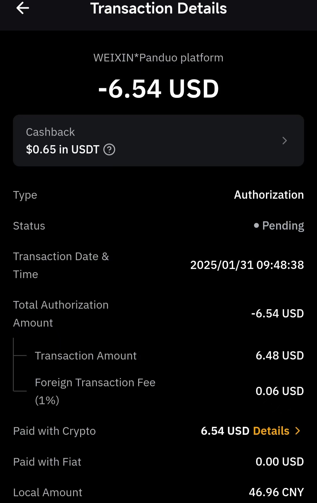
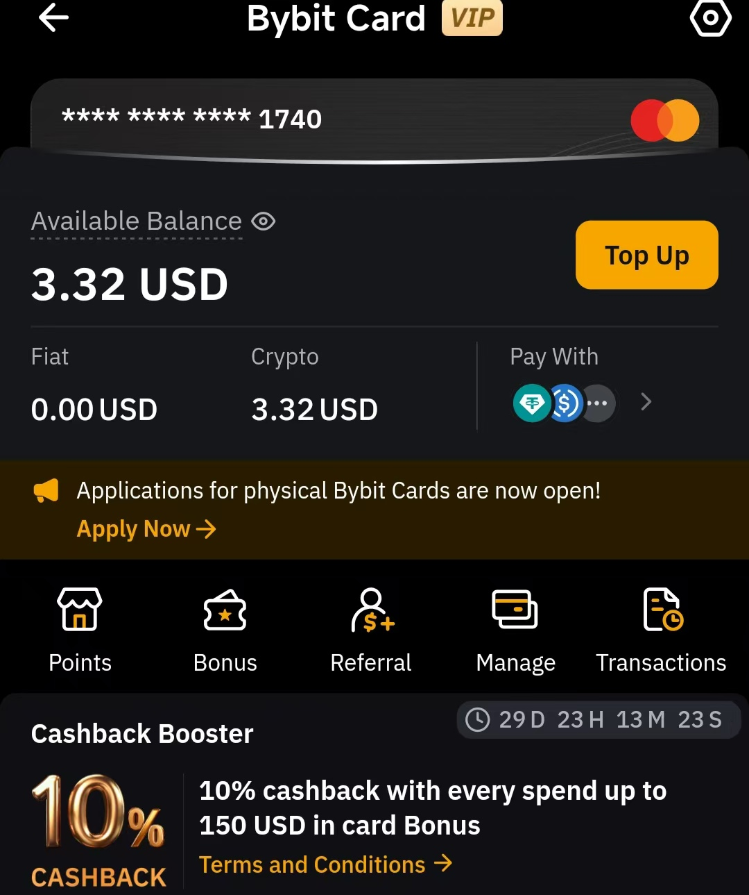
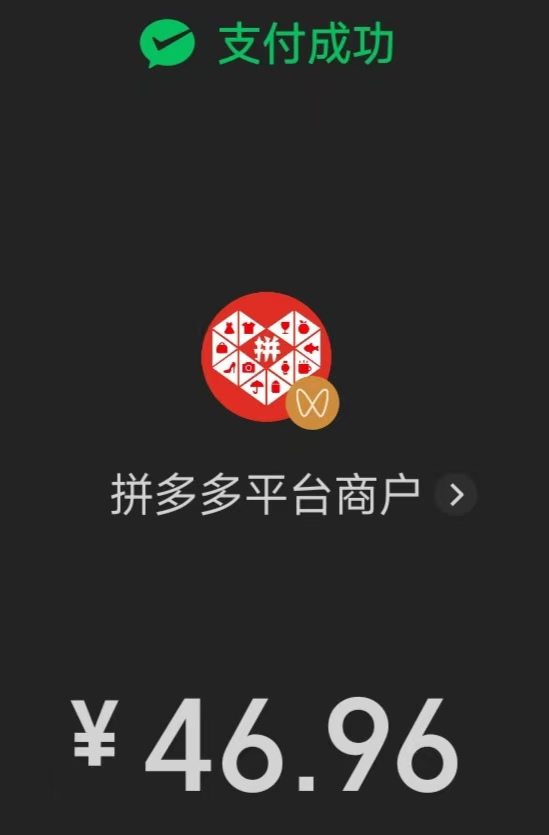
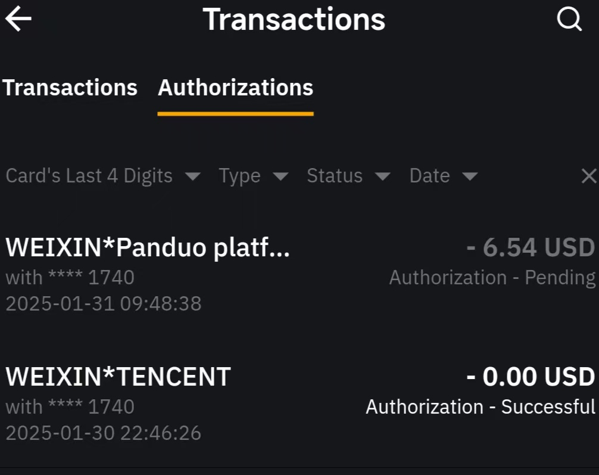

# [bybit u卡](/2025/01/bybit_u_card.md)

年初二 bybit u卡 的申请门槛貌似放开了 澳洲梯子IP+澳洲发卡地手机app端申请 不需要地址水电费证明kyc lv2就发卡了

选MasterCard万事达卡 可以绑微信支付宝 今早用u卡帮我妈在拼多多支付买菜、买电影票

u存简单赚币就进u卡了很方便 余额宝那样既能吃利息又能消费 手续费1% 返现10%

邀请码 6AYDDNN

## 每天600uATM提款额度

发卡地是澳大利亚 实体卡要转运到国内了... 香港应该有万事达卡的ATM

## 返现机制

不懂

