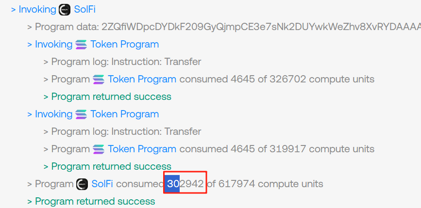

# [solfi暗池cu风控](/2025/10/solfi_abnormal_cu.md)

毕竟solfi早就升级了v2, 而且v2代码rust-solana-solfiv2-sdk泄露了，惹得solfi怒改代码

套利的用户 模拟的时候几万cu  实际交易30-80万cu风控你

```
大佬们 我这是被solfi埋伏了么
嗯solfi的cu很迷
solfi的cu浮动特别大 从<10w 到 20w

为什么模拟 SolFi的 CU差这么多  实际都是 10W+  模拟的大概就 8W
前几天研究发现 如果用了自己的合约 solfi会多20%cu
我之前测试下来人家的solfi在10w左右 我的在12-13w 
后来把合约去掉就好了
```


