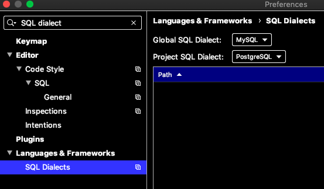

# [idea/jetbrains全家桶通用技巧](/archive/intellij_idea/idea.md)

## 「生产力」打开粘贴板历史

cmd+shift+v

clipboard history

## 代码间跳动

<i class="fa fa-hashtag"></i>
HTML标签/代码块 open/end之间跳动

<kbd>cmd</kbd>+<kbd>alt</kbd>+ <kbd>[</kbd> / <kbd></kbd>

> cmd+alt+[

<i class="fa fa-hashtag"></i>
在最近navigate的两处光标间跳动

如cmd+b找到方法的定义处，然后cmd+alt+左/友 返回

?> 还可以通过cmd+\[ 和 cmd+] 实现最近两处光标间跳动

## 编辑代码

<i class="fa fa-hashtag"></i>
复制当前行

cmd+d

?> cmd+d 还可以复制当前选中的单词

<i class="fa fa-hashtag"></i>
删除当前行

cmd+Backspace

<i class="fa fa-hashtag"></i>
选中当前变量名，并在所有出处放上光标

## 查看代码文档

Alt+SPACE、cmd+Y：快速查看方法的定义definition

★`cmd+P`：【】查看方法的入参parameter，并提示当前还差几个参数没输入

cmd+J/F1：查文档

Shift+F1：外部文档

cmd+N: 快速生成getter/setter方法

<i class="fa fa-hashtag"></i>
sout -> System.out.println

cmd+j 可以列出idea所有java代码的快捷输入

## 打开/关闭文件

不好用的搜索文件：cmd+1切换侧边栏，然后通过输入关键字查找文件

找到文件之后按Esc将光标退回editor，缺点是只能查找当前目录下的文件

> [!NOTE|label:两下￿￿shift]
> 按两下<kbd>Shift</kbd> 和vscode一样好用的查找输入框

找到并打开文件后可以点击导航栏的轮胎按钮定位到侧边栏中文件所在处

> [!TIP]
> 双击Shift还能在DataGrip中搜索字段名呢

cmd+Alt+O, cmd+O搜索类/字段等

DataGrip中cmd+Alt+O能搜索表的字段名，不过不能区分表名

## 错误处理

`F2`跳到下个错误，`Alt+Enter`列出解决错误的办法

## 配置全局/项目的SQL语法

打开preference，搜索SQL dialect，如图：

