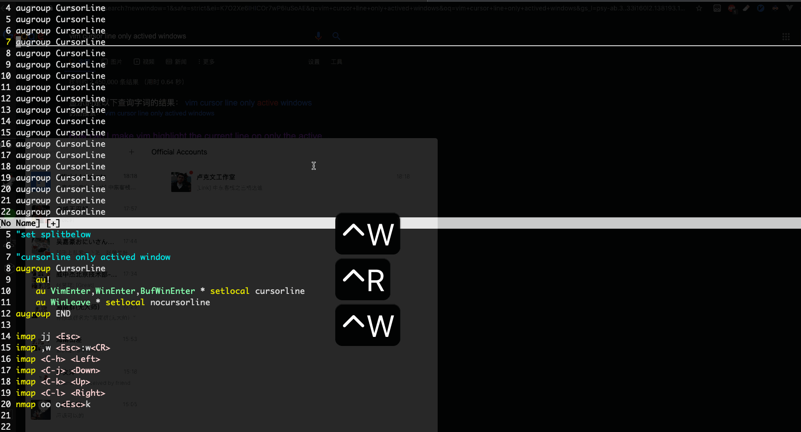

# [vim多文件编辑(buffer,tab,分屏)](archive/vim/multi-files)

vim同时编辑多个文件主要靠buffer，tab和分屏

> what is buffer/tab

:help window OR :help buffer

1. A buffer is the in-memory text of a file.
2. A window is a viewport on a buffer.
3. A tab page is a collection of windows.

## How to use buffer

### 查看/删除buffer

:ls 可以查看现在打开的buffer

:bd 删除buffer

### 切换buffer

:bN 打开第N个buffer的文件

Ctrl+^ OR :bn :bp :bf 切换buffer

## 比分屏更好用的tab

### new Tab

!> vim -p file1 file2 以多标签的方式打开多个文件

:tab ba # buffer expand to tabs

:tabe fileName

:tabnew 

tabfind查找【一个】文件并用新的标签页打开，如果有多个匹配结果会报错

:tabfind pathName

### 标签切换

:tabs - 显示所有标签页的信息

gt/gT - switch tab

2gt - 切换到标签2

:tabm N - 把当前标签页移动到第N，N不指定的话移动到最后

## 屏幕间切换

1. Ctrl+,hjkl - move cursor between window
2. Ctrl+w,w
3. Ctrl+i/o 在最近两个编辑的文件间跳动

## 分屏调整

- Ctrl+w,= - 分屏宽度平均分配
- Ctrl+w,HJKL - 左下上右移动当前屏幕

## NERDTree

### dir chagne

O - Recursively open the dir
X - Recursively close all children
C - change root to current dir
u - same as cd ..
R - refresh root dir

### cursor change

K - 跳到当前目录的第一个文件
J - 跳到当前目录的最后一个文件
Ctrl+j - 跳到下一个文件夹
Ctrl+k - 跳到上一个文件夹
P - Jump to the root node
p - Jump to current nodes parent

### Bookmark

B - toggle bookmark window
D - Delete bookmark

### 打开文件

o - 打开文件或书签
t - 在新标签页打开文件
T - 打开但是光标停在NERDTree

### NERDTree分屏

,t/:NERDTree - 打开NEARTREE

s/i - 水平/垂直分屏

go/gs/gi - 打开文件但是光标停留在NERDTree

---

用的较少的分屏知识:

> vim -o/O file1 file2 # 水平/垂直分屏打开文件
