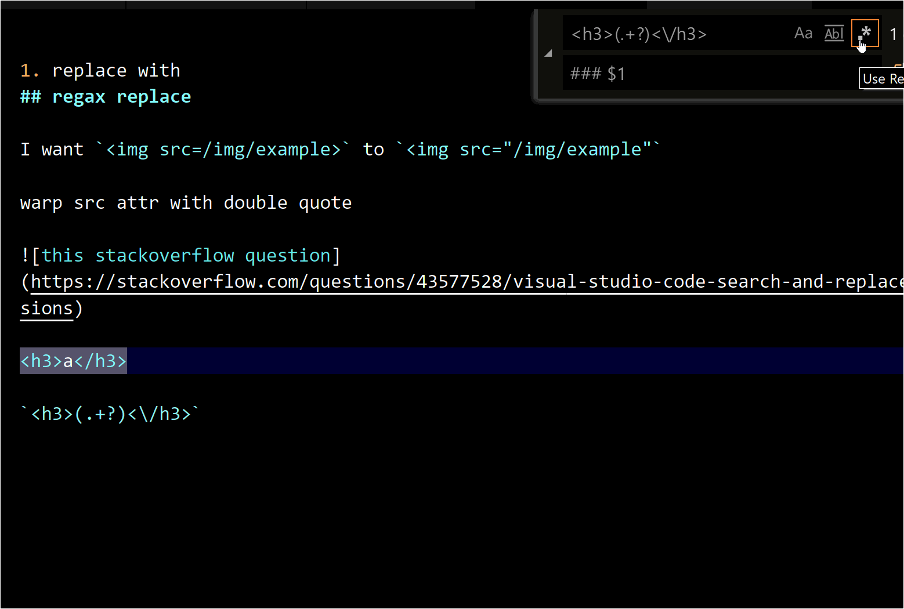

# vscode技巧快捷键笔记

## 快捷键

### vscode和idea快捷键对照表(mac)

*custom: 表示默认不提供，需要自己绑定快捷键

| command | vscode | IDEA |
|---| ------ | ---- |
|find actions/commands| cmd+shift+p | cmd+shift+o |
|find files| cmd+p | cmd+shift+o |
|find class| cmd+t(cmd+p,#) | cmd+o |
|find symbol| cmd+shift+o(cmd+p,@) | cmd+alt+o |
|code action| cmd+. | alt+enter |
|navigate to file tab 1| ctrl+1 | custom |
|navigate next error| alt+F2 | F2 |

- find symbol时@后输入一个:可以对symbol按类别进行分组

#### reproduce code action

下面这段代码，把光标放到match时, vscode/idea的code action都会提示用`if let`进行优化

```rust
fn main() {
    let a = Some(1);
    match a {
        Some(a) => println!("{}", a),
        None => {}
    }
}
```

### switch terminal tab

<i class="fa fa-hashtag"></i>
https://stackoverflow.com/questions/44065101/vs-code-key-binding-for-quick-switch-between-terminal-screens

[egghead.io](http://egghead.io)上面现在有VScode的教程，等我看完后再更新本文吧...

### F2 refactor/rename

## 用正则筛出html文本批量替换

Input:  `<h1>Title</h1>`

Output: `# Title`

Regax: `<h1>(.+?)<\/h1>`

Replace: `# $1`

将html的<h1>标签转为markdown的一个井号的一级标题写法: [stackoverflow](https://stackoverflow.com/questions/43577528/visual-studio-code-search-and-replace-with-regular-expressions) 


