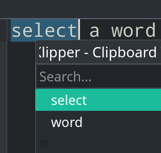

# [禁用鼠标中键粘贴](/category/archlinux/copy_on_select_disable_middle_button.md)

```
似乎所有Linux桌面环境都有copy-on-select的功能
以KDE为例鼠标选中文本后按鼠标中键就能粘贴
挺方便的食指轻轻一动完成复制粘贴

有意思的是鼠标选中内容会存放到klipper粘贴板位置1(如图1)
但会放到fcitx粘贴板的位置2(如图2)
这粘贴板的差异要用linux的哪些知识去解释?
```

我一直很好奇<kbd>Ctrl</kbd>+<kbd>;</kbd>快捷键弹出的最近5个粘贴板内容是从哪来的，

因为我看KDE自带的klipper UI跟它不一样啊



> qdbus | grep klipper

于是我搜`Ctrl+;`关键词没有有用的信息，换者关键词搜`ctrl+semicolon`就能搜到原来它是fcitx输入法框架的粘贴板


---

但让我恼火的是鼠标中键关闭vscode标签页时，如果误触到文件内容则关闭标签页就变成往代码粘内容(然后ra报错风扇就开始咆哮了)

所以专注写代码时可以把鼠标中键盘禁用掉，通过C-x,k关闭当前的标签页

安装`xorg-xinput`包后通过`xinput list`找到了我的鼠标外设ID`Logitech USB Laser Mouse id=17`

(2021成都Rust meetup中aws分享的虚拟机其实就只有Power Button一个外设)

启用鼠标中键(1 2 3分别表示鼠标左键映射成1，中键映射成2，右键映射成3):

> xinput set-button-map 17 1 2 3

禁用鼠标中键:

> xinput set-button-map 17 1 0 3

## 参考资料

- <https://askubuntu.com/questions/894673/why-my-ctrlsemicolon-was-binded-globally>
- <https://wiki.ubuntu.com/X/Config/Input>
