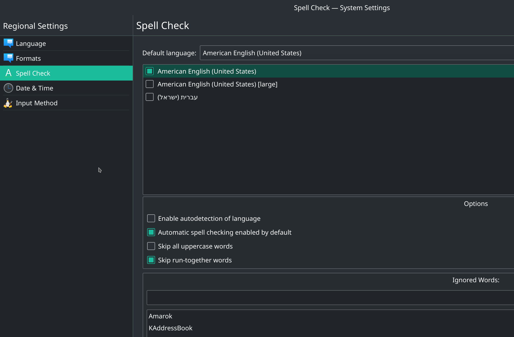
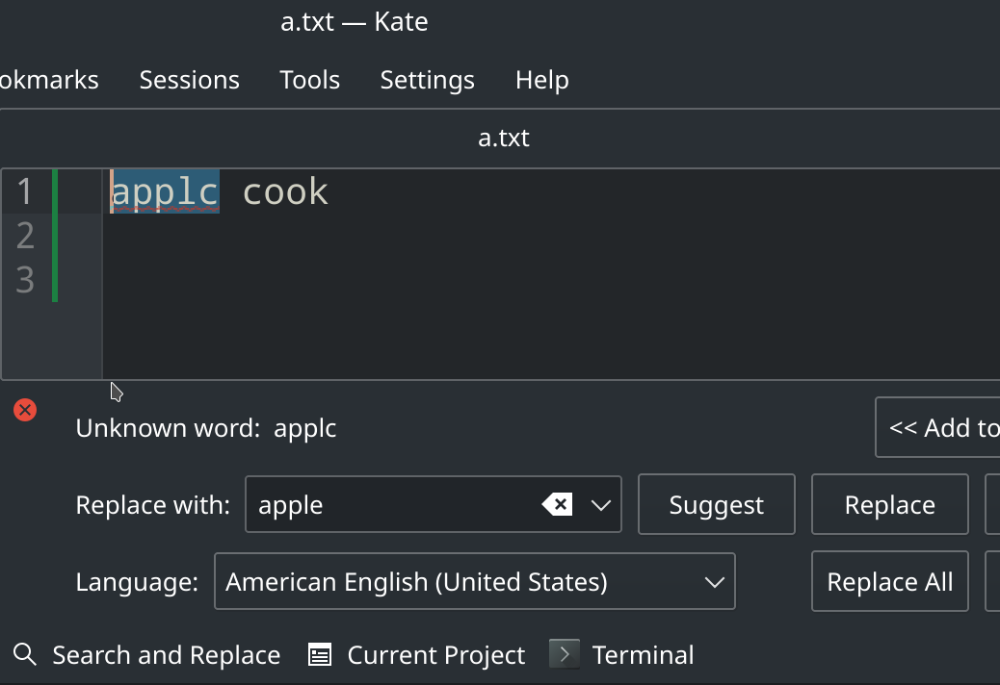

# [解决 KDE spell check 报错](/category/archlinux/kde_spell_check.md)

带图形桌面的操作系统例如 raspbian, manjaro_kde, macos 都会内置 spell_check 以便系统预装应用可以进行拼写检查

但是 KDE 系统设置的 spell_check 的默认 language 配置是乱码，以下官方截图也是乱码

导致命令行运行 kate 会出一堆报错 `kf.sonnet.core: Sonnet: Unable to load plugin xxx.so`

KDE 用的是 sonnect 作为拼写检查的框架，需要安装以下三个动态链接库

> sudo pacman -S aspell hspell libvoikko

解决完拼写检查缺失的动态链接库，还要安装英语的词典文件作为语料库

> sudo pacman -S hunspell-en_us

装完之后可以通过 `hunspell -D` 查看词典的搜索路径

> [w@w-manjaro temp]$ hunspell -D
> 
> SEARCH PATH:
> 
> .::/usr/share/hunspell

可见 KDE 拼写检查用的不是 `sudo pacman -S words` 装的 `/usr/share/dict/words` 单词表

装完拼写检查的动态链接库和词典后，去系统设置里切换默认词典和禁用`auto detect language`(当然在 kate 里也能打开这个设置页面)

设置完成后 kate 就能像 windows 的 office 那样在拼写错误的单词下标注红线并给出候选词建议

除了 kate 用到了拼写检查, dolphin 重命名文件时也会进行拼写检查

## Kate 的一些技巧

左边侧边栏选 `projects` 标签可以浏览 git repo 的所有文件

`ctrl+alt+o` 可以按文件名搜索 repo 内的所有文件，以便快速打开某文件

## 参考链接

- <https://forum.manjaro.org/t/kate-unable-to-load-plugin/42138>
- <https://askubuntu.com/questions/1036595/adding-spelling-dictionary-to-kde-applications>
- <https://forum.kde.org/viewtopic.php?t=140513>
- <https://archlinux.org/packages/extra/any/hunspell-en_us/>
