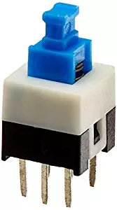

# 以中断方式读轻触按键

## 其它编程语言里的中断

当我学JavaScript的addEventListener的时候突然醒悟

这不就是Arduino等单片机(Microcontroller)的「中断」吗

在分析为何使用中断读取按键前，我先介绍下什么是按键开关

## 按键开关

按键开关可以分为两种：自锁的和非自锁的

比如电源开关都是自锁的，而打字用的键盘一松手就会弹起是非自锁的

自锁这个概念可能是从继电器引入的吧

电子元器件常用的自锁开关如图



按键开关一般使用非自锁的，下图这种叫轻触开关


淘宝/eBay/amazon中搜索push button都能找到

有人可能会问按键逻辑上应该只有两端，为什么会有四个脚？

实际使用中其实只有两个脚，「万用表」打到蜂鸣档测出按下时引脚之间的哪个会通

轻触开关有四个引脚，**只用对角线两个引脚就行了**

## 引脚浮动(floating pin)

按键开关一端接地一端接引脚a，我们可以用digitalRead读取

按住开关时，轻触按键内部短路，引脚a被短路读到低电平

但是按键松开时，引脚a短路(什么都没接)

这时如果拿示波器/串口监视器查看引脚a电平

会发现引脚a在0和1之间漂浮不定

给读取按键的引脚一个「默认值」就能解决这个问题

## 上拉电阻

这是

官方教程中需要一个电阻，我是喜欢软件复杂点也不要电路复杂点

好在Arduino引脚模式提供INPUT_PULLUP自带上拉电阻的输入模式

所谓的上拉模式，其实就是引脚悬空时默认为高电平

这时把引脚一端接按键，按键的另一端接地，按键按下时可以读到电平从1->0的变化过程

## 按键抖动

然而电平变化的过程不是「物理书上写得那么理想」

由于种种原因，引脚电平1->0的边沿会有「正弦振荡」

单片机一般用delay让CPU发呆躲掉这段不稳定的振荡

但我不喜欢CPU空转，很讨厌delay/sleep这种阻塞进程的东西

其实只要读按键电平变化的第一个上升沿或下降沿即可，基本上Arduino有FALLING这种读取模式设定(通过中断)

## 定时器中断(setInterval)读取按键状态

普通读取按键的方法只能在每次主循环中检测按键是否变化，浪费时间而且效率很低

也可设一个定时器中断，每隔50ms读取一次按键状态

推荐使用Arduino的Metro第三方库，是我见过的唯一可以修改定时间隔的库

JavaScript的setInterval函数也没法动态修改间隔

之前说过读取按键需要delay去除抖动，而delay又会让定时器停滞，定时器中断有待商榷

## 按键触发外部中断最高效

设置一个外部中断，当按键按下时使得中断引脚电平从1变为0

当下降沿出现时执行某个函数，而不用等边沿正弦振荡过后才读取

Arduino UNO有两个外部中断号，中断号0用的是引脚2

推荐DFrobot的[attachInterrupt函数使用手册](http://wiki.dfrobot.com.cn/index.php?title=Arduino%E7%BC%96%E7%A8%8B%E5%8F%82%E8%80%83%E6%89%8B%E5%86%8C#attachInterrupt.28.29)

用attachInterrupt函数将中断号绑定到某个函数中(有点像js的addEventListener)

让我想起汇编语言的「中断向量表」，有点像一个字典，字典的键是中断号，值是中断执行函数的地址

利用外部中断读取按键是否按下完美解决了按键抖动等问题，缺点就是中断号太少了

**以下是我在电子设计大赛中用按键切换工作模式的例子**

2015年的TI杯电赛I题是一个风板控制系统，有两个摆动模式

我用了两个轻触按键来表示模式1和模式2，以下代码演示了如何读取按键并执行相应模式

```c
volatile byte mode = 0;

void int0() {
  mode = 1; // 切换到模式1
}

void int1() {
  mode = 2; // 切换到模式2
}

void setup() {
  pinMode(2, INPUT_PULLUP); // 输入模式默认高电平(上拉)
  pinMode(3, INPUT_PULLUP);
  // 外部中断0-引脚2，中断执行int0函数， 下降沿触发
  attachInterrupt(0, int0, FALLING);
  attachInterrupt(1, int1, FALLING);
}

void loop() {
  if (mode == 1) {
    // execute mode1
    mode = 0;
  }
  if (mode == 2) {
    // execute mode2
    mode = 0;
  }
  // 可以做更新LCD显示之类的事
}
```

把所有模式的执行部分放入loop函数中，用loop函数的局部变量可以实现多模式共用数据

如果把模式1的执行部分也丢到中断内，多模式的数据只能靠全局变量交互

更糟糕的是，中断函数执行时间过长阻塞了其它中断的触发

所以中断函数内一般修改几个全局变量的值就够了
