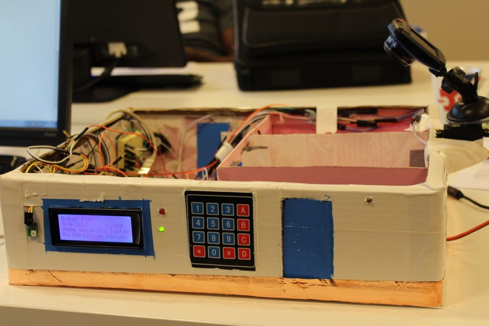
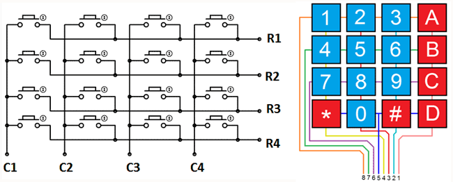
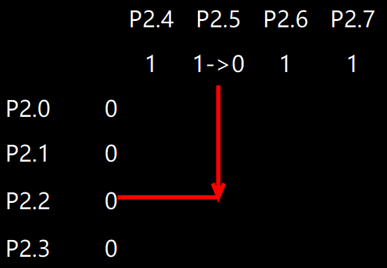

# 矩阵键盘(keypad)

## 我与矩阵键盘

从我进学校机电楼的实验室起，我就在学长们的单片机作品上看过矩阵键盘。



实际上在我大一买的那块51开发板，矩阵键盘还没有上面那层膜，大部分开发板的矩阵键盘裸露的。

尝试去YouTube上面找视频弄懂原理，也没弄懂。

最后是在无线电调试工的高级工单片机实训中，掌握了如何使用。

这种高级工考试水分也很大，单片机部分总共就两题，洗衣机和售货机，考场上奇数号的做售货机，偶数号的做洗衣机。

矩阵键盘是售货机的一个模块，虽然学校安排两周去学这两种题，到最后考场座位安排出来后，我分到的题目是洗衣机，老师都让我拿着答案的程序去背。

## 牺牲时间换取空间

采用独立对地按键(我上篇文章介绍了按键开关)完成相同的功能，至少需要16个I/O口，还不算上拉/下拉电阻。

矩阵键盘设计上的巧妙之处在于8位单片机能同时控制8个I/O。

代码量大大减少，无额外的外围电路，代价仅仅是读取过程需要两步完成，牺牲两倍时间。



## 单片机如何读取矩阵键盘

当按其中一个按钮时，按钮所在的行和列就会被短路

单片机只需捕获这种变换就能判断哪一个按键被按下

以51单片机为例(Arduino UNO的寄存器名字不记得了，所以用51)

硬件连接：P2.0~P2.3连矩阵键盘一到四行，P2.4~P2.7连第一列到第四列

软件部分: P2寄存器设为0x0f->调用keyscan函数

->当P2变化时->延时去抖动->确认按键还在按下

假设第三行第二列的按键被按下



如图，P2.5因「第二列有按键被按下」，但不知道按键在第几行

所以P2.5就被**短路**电平被拉低

找个临时变量column存下P2寄存器当前状态

把P2赋值为0x<b style="color:red">f0</b>，P2变化原理同上

发现P2.2电平从1变为0，确认第三行有按键被按下

最终确认被按下的按键在第三行第二列

## 程序代码(不含数据处理部分)

```c
typedef unsigned char byte;
void keyscan() {
  byte nop=10, row, column;
  while (P2 != 0x0f) {
    while (nop--); // 去抖动
    if (P2 != 0x0f) { // 确认有按键按下
      column = P2;
      P2 = 0xf0;
      row = P2;
    }
    /* TODO数据处理部分? */
    P2 = 0x0f; // P2回到默认值
  }
}
```

## 「算法」读到的两个P2值如何转化为行和列

假设第一行第二列的按键被按下

上我在高级工单片机实训中的实物图，真实反映状态变化过程


数据={'column'=0b0000_1011,'row':0b0111_0000}

**几个方案**

将row按位取反->通过log2函数得行号(缺点，需要用到math库，而且对数结果时浮点数还需进一步处理)

当row前四位不是0111时->对row前四位向左循环移位->移位次数=行号

C语言又没有Python字典，还是switch语句算了

```c
char keyscan() {
  byte nop=10, column, key;
  if (P2 != 0x0f) {
    while (nop--); // 去抖动
    if (P2 != 0x0f) { // 确认有按键按下
      column = P2;
      P2 = 0xf0;
      // 假设第一行第二列的按键被按下
      // 'column'=0b0000_1011,'row':0b0111_0000
      key = P2 | column; // 得到0b0111_1011
    }
    P2 = 0x0f; // P2回到默认值
    switch(key) {
    case 0b0111_1011:
      return '4';
    ...
    }
  }
}
```

## 再谈谈引脚复用

牺牲两倍时间节省一半引脚，当让我想起台湾师范大学吳順德教授在数字电路课程中的一句话

「组合逻辑复杂，时序部分就简单; 时许复杂组合逻辑可以设计得简单点」(对于同一个状态图而言)

相关视频推荐GreatScott的「How to Multiplex」

这个视频讲解了光立方里面引脚复用技术，让极少引脚的Arduino也能控制上百个LED组成的光立方

GreatScott还有个视频使用「树莓派」一个引脚控制几百个LED，也就ARM处理器的速度能满足这样的复用
