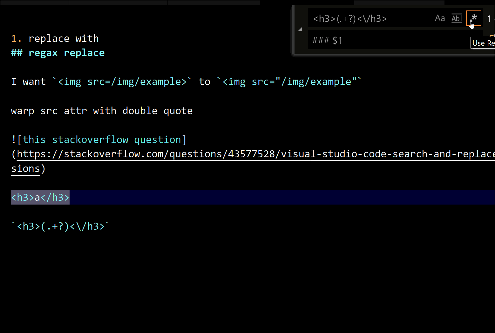

# vscode

## shortcut

### cursor

§ 光标上下左右

首先 Ctrl+n/p/b/f/a/e 进行光标上下左右行首行尾移动的配置是必要的，如有冲突原有的绑定例如 ctrl+F 搜索文本则改成 cmd+F

§ 代码跳转(jump_to_next_problem, go_back)

- go_forward: ctrl+1
- go_back: ctrl+2
- go_to_define: ctrl+3, find_all_refs/impl: ctrl+4/5
- go_to_next_problem: f1 // current file next problem
- go_to_next_problem_in_files: alt+f2P
- view_problems: ctrl+shift+`/ctrl+shift+m(default)

## code snippet

搜索`User snippet` command，然后新建一个rust专用的snippet，输入以下内容

```json
{
	"log::info": {
		"scope": "rust",
		"description": "log::info",
		"prefix": "logi",
		"body": "log::info(\"$0\");",
	}
}
```

虽然ra也提供`"".logi`的自动补全，但还是不如直接输入logi方便

---

## vscode和idea快捷键对照表(mac)

*custom: 表示默认不提供，需要自己绑定快捷键

| command | vscode | IDEA |
|---| ------ | ---- |
|find actions/commands| cmd+shift+p | cmd+shift+o |
|find class| cmd+t(cmd+p,#) | cmd+o |
|find symbol| cmd+shift+o(cmd+p,@) | cmd+alt+o |
|quick fix/code action| ctrl+. | alt+enter |
|navigate back| ctrl+-| cmd+[ |
|navigate forward| ctrl+shift+-| cmd+] |
|navigate to file tab 1| ctrl+1 | custom |
|navigate next error/problem| alt+F2 | F2 |

find symbol时@后输入一个:可以对symbol按类别进行分组

~~Ctrl+; 自动补全建议~~

### 一些比较重要的vscode快捷键名称

§ quickOpenNavigateNext

功能: 按`Ctrl+P`类似命令的弹窗中光标往下，必须改成Ctrl+N

§ selectNextSuggestion

功能: 代码补全建议弹窗中往下选择，必须改成Ctrl+N

### reproduce code action

下面这段代码，把光标放到match时, vscode/idea的code action都会提示用`if let`进行优化

```rust
let a = Some(1);
match a {
	Some(a) => println!("{}", a),
	None => {}
}
```

### switch terminal tab

<i class="fa fa-hashtag"></i>
https://stackoverflow.com/questions/44065101/vs-code-key-binding-for-quick-switch-between-terminal-screens

[egghead.io](http://egghead.io)上面现在有VScode的教程，等我看完后再更新本文吧...

---

## vscode tricks

### 用正则筛出html文本批量替换

Input:  `<h1>Title</h1>`

Output: `# Title`

Regex: `<h1>(.+?)<\/h1>`

Replace: `# $1`

将html的<h1>标签转为markdown的一个井号的一级标题写法: [stackoverflow](https://stackoverflow.com/questions/43577528/visual-studio-code-search-and-replace-with-regular-expressions) 


