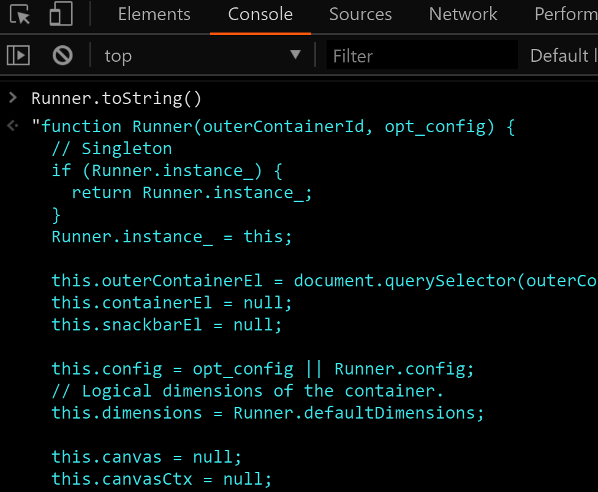

# chrome的恐龙奔跑游戏中作弊


## 游戏简介

断网时谷歌浏览器会出现一个恐龙奔跑的游戏

其实无需断网通过 [chrome://dino](chrome://dino) 或 [about:dino](about:dino) 可直接进入游戏

游戏操作: ↑跳跃或↓下蹲避开障碍物，按Alt可以暂停

## 审查网页

这个游戏的动画是用canvas元素实现

想找源代码就在键盘事件中设置Event listener breakpoint


结果发现是在Runner对象内部处理键盘事件

## 找下Runner Object的源码

js的有个toString方法可以查看某个Object的源代码



Runner函数源码一开始就是「**单例模式**」实现部分

所以用Runner.instance_就能获取当前游戏对象

不过Runner.toString出来的源码有点少，很可能不是完整的

继续想办法看看页面的js源码在哪，结果发现来自VM...


VM前缀的js代码可能在以下地方

- console内
- eval
- HTML的script标签内

排除前两种可能，很快在第四个script标签内找到了游戏源码


## 游戏作弊

只要把gameover事件的处理函数改为空,

即便碰到障碍物触发了gameover也会当做无事发生继续游戏

```javascript
// 存储旧的gameover Handler以便手动结束游戏
var gameoverOld = Runner.instance_.gameOver;

Runner.instance_.gameOver = () => undefined;
```


## 参考文章

[chrome-dino-hack](https://mathewsachin.github.io/blog/2016/11/05/chrome-dino-hack.html)

[chrome十周年之际, chrome69的dino游戏蛋糕彩蛋](https://www.blog.google/products/chrome/chrome-dino/)
