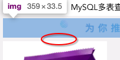

# 仿京东的vueAPP中遇到的问题

## v-for跟传统模板语言不太一样

习惯了python的jinja2的我，遇到需要生成10个相同图片的需求，就简单的写上

> &lt;div v-for="item in items">&lt;img src="{{ item.src }}">

vue只有innerText部分的js表达式用双花括号，而jinja2没这种区分

vue标签的属性内想用js的表达式，那么这个属性要加上v-bind:的前缀

如 v-bind:src **可缩写为:src**

上面这段v-for还有一个错，没有指定for循环的索引，v-for后面必须指定索引，

通常让 :key=index 提高迭代时的查询速度

### v-for traverse array

> [!NOTE|label:v-for_traverse_array]
> &lt;div v-for="index in arr.length" :key=index>{{ arr[index-1] }}&lt;/div>

## 善用console排错

第一次加载swiper的组件失败了，页面相应位置一片空白，此时应该自行找console怕错不要依赖找组长解答

## gap below img tag

如果不希望如图img标签下面有未定义的间隙

解决方案：改成display: block

## 删掉git仓库的.DS_Store

记录项目笔记时发现我个人博客的git仓库好多闲杂文件

> find . -name ".DS_Store" -print -delet

## ~~Firefox无法通过代理科学上网~~

这个问题尝试解决，没有成功，先放弃。