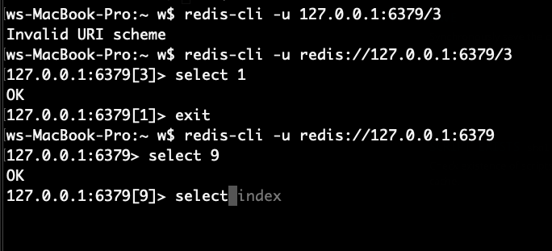

# redis技术积累

## 为什么要用redis

某些业务需求下，读写速度比MySQL快

有些时效性较短的数据，例如每日取消订单3次就禁止交易功能中，用户的当日取消订单次数，就很适合用redis存储

## redis应用案例

### 连续24小时内只能创建3个订单

时效性短的数据，可存储于redis中减轻MySQL的负载

例如实现用户当日取消订单超过3次就限制交易的功能

类似用户当日取消订单超过3次就限制交易的业务逻辑还有: 用户当天最多发起3次申诉

这个功能用ActiveRecord实现的代码(BETWEEN..AND)是`where(state: 'cancel', updated_at: Date.today.beginning_of_day..Date.today.end_of_day)`

Redis实现的伪代码如下，业务需求是连续24小时内不能取消超过3次

```rust
const ONE_DAY = 24 * 60 * 60;
let key = "user_#{user.id}_today_cancel_count"
let ttl = redis.send("TTL #{key}");
// 确保key的持续时间不是无穷
let value;
if ttl > 0 {
    value = redis.send("GET #{key}");
    value += 1;
    retid.send("SET #{key} #{value} EX #{ttl}");
} else {
    redis.send("SET #{key} 1 EX #{ONE_DAY}");
    value = 1;
}
if value > 3 {
    // ...
}
```

## PING

除了ping还可以使用brew services list检查redis服务器状态

## pubsub机制

听说实现原理是WebSocket

订阅是 `subscribe $channelName`
 
推送消息是 `publish $channelName $message`

推送消息成功后会返回一个integer，告诉收听频道者的数量

通常用于跨语言跨进程跨机器的通信，不过进程间通信更应该使用性能更好的TcpStream或UnixSocket

## AUTH(输入密码)

redis连接默认不需要密码，只要知道端口号就能连上，相比MySQL安全性较差

就算加了密码其实也能连上，只不过不能执行任何命令(除了AUTH)

AUTH命令连续输出几次密码就会强行断开连接

在redis-cli中携带密码参数的方式:

> redis-cli -h localhost -p 6379 -a password

## SELECT(切换数据库)

redis_url中斜杠后面的数字表示db_index默认情况下redis连接的是0号数据库

例如`redis-cli -u 127.0.0.1:6379/1`连接的是1号数据库

像async-redis这样的redis库用的是标准socketAddress，所以url中不能带斜杠

只能在连上redis之后发送SELECT命令更换数据库，类型MySQL的use xxx



## MONITOR(类似打log)

redis不像关系型数据库那样有log，所以需要monitor这样的命令去监控当前数据库执行的redis命令

当redis频繁使用时，想用monitor去Debug时滚屏非常快，完全没法找到想看的redis命令

如何<var class="mark">过滤</var>monitor的输出内容:

> redis-cli monitor | grep -iE 'SET'

通过管道加 grep -iE '关键词' 能过滤monitor的滚屏内容，只保留想要看到的部分

## redis数据结构

### redis队列?

k线数据在redis中是通过一种类似队列或者叫list的数据结构去存储

### HSET/HGET HashMap

## CLUSTER(集群)

TODO

## commands issued

在redis-async库中首次接触这个概念，redis-async库有两种建立连接的方式，其中一个区别就是对commands issued的处理

我查阅资料后了解到commands issued相当于「事务处理」的失败情况?

非关系型数据库例如redis的事务处理的稳定性不如MySQL，所以redis的事务处理算是不稳定的不能依赖的

## KEYS *

列出当前db的所有key

## TTL

检查某个key是否超时，获取该key的expired_in(剩余时间)

如果持续时间是无穷则返回-1，key不存在(已过期也属于不存在的情况)则返回-2

TTL返回的剩余时间和SET命令的EX选项的单位一样，单位都是秒

## SET/GET/DEL ${key}

设置/获取/删除 键值对
