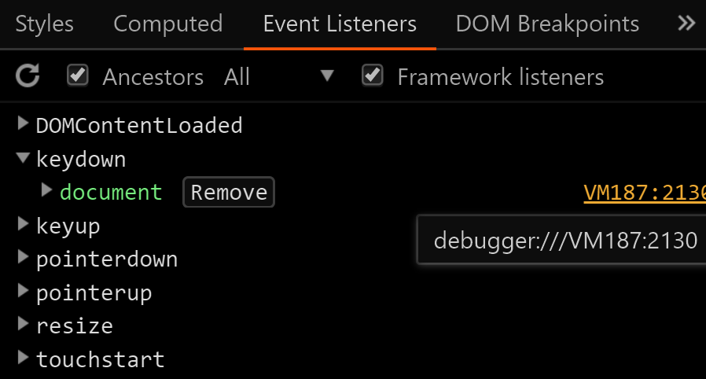

# chrome的恐龙奔跑游戏中作弊


断网时chrome(谷歌浏览器)会出现一个恐龙跑酷类游戏

其实无需断网，通过 [chrome://dino](chrome://dino) 或 [about:dino](about:dino) 可直接进入游戏

> [!TIP|label:游戏操作|]
> 通过↑跳跃和↓下蹲躲开障碍物，Alt暂停

如果想要在这个游戏里「开挂」，既然是个纯前端的游戏

用浏览器的Devtools应该能找到源码分析游戏漏洞

## 审查网页Inspect

!> 既然游戏用键盘操作，那就设置键盘监听事件的【断点】


发现是在JS的Runner对象内处理键盘事件

## 继续找源码

那就通过Runner.toString方法,看某个Object的源代码


第一个If语句「**单例设计模式**」实现部分之一

由于源代码太长在console内只打印了前面一点，后面都省略了

进一步看页面的JS源码在哪，结果发现来自VM...



VM前缀的js代码可能在以下地方

- console内
- eval
- HTML的script标签内

排除前两种可能，很快在HTML页面的第四个script标签内找到了游戏源码


## 游戏作弊

只要把gameover事件的处理函数改为空,

即便碰到障碍物触发了gameover也会当做无事发生继续游戏

```js
// 存储旧的gameover条件，以便手动结束游戏
var gameoverOld = Runner.instance_.gameOver;

Runner.instance_.gameOver = () => undefined;
```


## 参考文章

[chrome dinohack](https://mathewsachin.github.io/blog/2016/11/05/chrome-dino-hack.html)

[(需翻墙)As the Chrome dino runs, we caught up with the Googlers who built it](https://www.blog.google/products/chrome/chrome-dino/)
